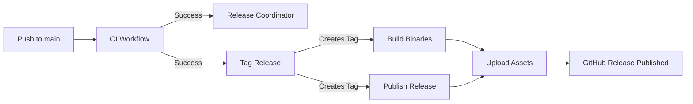

# Release Process Documentation

## Overview

gitshift uses an automated release process triggered by successful CI runs on the `main` branch. The process creates version tags, builds multi-platform binaries, and publishes GitHub releases.

## Workflow Architecture



## Workflows

### 1. **CI Workflow** (`ci.yml`)
- **Trigger**: Push to `main`, pull requests
- **Purpose**: Run tests, linting, build verification
- **Output**: Success/failure status

### 2. **Release Coordinator** (`release-coordinator.yml`)
- **Trigger**: After CI success on `main`
- **Purpose**: Check if there are new commits since last tag
- **Output**: Decision to trigger release or skip

### 3. **Tag Release** (`release-tag.yml`)
- **Trigger**: After CI success on `main`
- **Purpose**: Calculate version, create and push git tag
- **Version Logic**:
  - **Major** (`v2.0.0`): Commits with `BREAKING CHANGE` or `feat!`
  - **Minor** (`v1.1.0`): Commits with `feat:`
  - **Patch** (`v1.0.1`): All other commits (fix, docs, chore, etc.)
- **Output**: Creates git tag (e.g., `v1.1.0`)

### 4. **Build Binaries** (`release-build.yml`)
- **Trigger**: Push of version tag (`v*`)
- **Purpose**: Build binaries for all platforms
- **Platforms**:
  - Linux (amd64, arm64)
  - macOS (amd64, arm64)
  - Windows (amd64, arm64)
- **Output**: Binaries uploaded as workflow artifacts

### 5. **Publish Release** (`release-publish.yml`)
- **Trigger**: Push of version tag (`v*`)
- **Purpose**: Create GitHub release with binaries
- **Output**: Published GitHub release with downloadable assets

## Important: GitHub Token Limitation

⚠️ **By default, tags created by GitHub Actions won't trigger the build/publish workflows.**

This is a GitHub security feature to prevent infinite workflow loops. When a workflow uses `GITHUB_TOKEN` to push a tag, GitHub does not trigger other workflows from that tag push.

### Solution: Use a Personal Access Token (PAT)

To enable full automation, configure a PAT:

#### Step 1: Create a Personal Access Token

1. Go to GitHub Settings → Developer settings → Personal access tokens → Tokens (classic)
2. Click "Generate new token (classic)"
3. Set a descriptive name: `GitShift Release Automation`
4. Select scopes:
   - ✅ `repo` (Full control of private repositories)
5. Set expiration (recommend: 90 days with calendar reminder to renew)
6. Click "Generate token"
7. **Copy the token immediately** (you won't see it again!)

#### Step 2: Add Token to Repository Secrets

1. Go to your repository → Settings → Secrets and variables → Actions
2. Click "New repository secret"
3. Name: `RELEASE_TOKEN`
4. Value: Paste the PAT you copied
5. Click "Add secret"

#### Step 3: Verify Configuration

The `release-tag.yml` workflow is already configured to use this token:

```yaml
token: ${{ secrets.RELEASE_TOKEN || secrets.GITHUB_TOKEN }}
```

- If `RELEASE_TOKEN` exists: Uses PAT (enables full automation)
- If not: Falls back to `GITHUB_TOKEN` (tags created, but builds won't trigger)

## Manual Release (Alternative)

If you prefer not to use a PAT, you can trigger releases manually:

### Option 1: Create Tag Manually

```bash
# Checkout main and pull latest
git checkout main
git pull origin main

# Create and push tag
git tag -a v1.2.0 -m "Release v1.2.0"
git push origin v1.2.0
```

This will trigger the build and publish workflows.

### Option 2: Use GitHub CLI

```bash
# Create a release
gh release create v1.2.0 --generate-notes

# Or with custom notes
gh release create v1.2.0 --notes "Release notes here"
```

## Version Calculation

The automated version bump is based on conventional commits:

| Commit Pattern | Version Bump | Example |
|----------------|--------------|---------|
| `feat: add new feature` | Minor | v1.0.0 → v1.1.0 |
| `fix: resolve bug` | Patch | v1.0.0 → v1.0.1 |
| `docs: update readme` | Patch | v1.0.0 → v1.0.1 |
| `feat!: breaking change` | Major | v1.0.0 → v2.0.0 |
| `BREAKING CHANGE: ...` | Major | v1.0.0 → v2.0.0 |

### First Release

If no tags exist, the workflow starts from `v0.0.0` and calculates the first version based on all commits in the repository.

## Commit Message Conventions

To ensure proper version bumping, follow these conventions:

```bash
# Minor version bump (new feature)
git commit -m "feat: add support for Bitbucket"

# Patch version bump (bug fix)
git commit -m "fix: resolve SSH key parsing issue"

# Patch version bump (documentation)
git commit -m "docs: update installation instructions"

# Major version bump (breaking change - method 1)
git commit -m "feat!: redesign configuration format"

# Major version bump (breaking change - method 2)
git commit -m "feat: redesign configuration format

BREAKING CHANGE: Configuration format has changed.
Users must migrate their config files."
```

## Troubleshooting

### Tag was created but no binaries/release

**Cause**: Workflows triggered by `GITHUB_TOKEN` don't cascade to other workflows.

**Solution**: Add `RELEASE_TOKEN` secret (see above).

### Tag was created with wrong version

**Cause**: Commit messages don't follow conventional commits format.

**Solution**:
1. Delete the tag: `git tag -d v1.1.0 && git push origin :refs/tags/v1.1.0`
2. Fix commit messages and push again

### No tag was created

**Causes**:
- No new commits since last tag
- CI workflow failed
- Release workflow not triggered

**Debug**:
```bash
# Check if there are new commits
git log v1.0.3..main --oneline

# Check CI status
gh run list --workflow=ci.yml --limit 5

# Check release workflow status
gh run list --workflow=release-tag.yml --limit 5
```

### Build fails on specific platform

**Cause**: Platform-specific build issues.

**Solution**:
1. Check build logs: `gh run view <run-id> --log-failed`
2. Test locally: `GOOS=linux GOARCH=amd64 go build -o gitshift-linux-amd64`
3. Fix issues and push fix

## Testing the Release Process

To test without creating actual releases:

1. **Create a test branch**:
   ```bash
   git checkout -b test-release
   ```

2. **Make test commits**:
   ```bash
   git commit --allow-empty -m "feat: test feature"
   git push origin test-release
   ```

3. **Check workflow runs**:
   ```bash
   gh run list --branch test-release
   ```

4. **Clean up**:
   ```bash
   git checkout main
   git branch -D test-release
   git push origin :test-release
   ```

## Monitoring Releases

### View Recent Releases

```bash
# List releases
gh release list --limit 10

# View specific release
gh release view v1.1.0

# Download release assets
gh release download v1.1.0
```

### View Workflow Runs

```bash
# All workflows
gh run list --limit 10

# Specific workflow
gh run list --workflow=release-tag.yml --limit 5

# Watch a run in progress
gh run watch <run-id>
```

## Release Checklist

Before merging to `main`:

- [ ] All tests pass locally
- [ ] Commit messages follow conventional commits
- [ ] Breaking changes are documented
- [ ] Version bump is appropriate for changes
- [ ] CI is passing on PR
- [ ] Documentation is updated

After merge:

- [ ] CI completes successfully
- [ ] Tag is created (check `gh release list`)
- [ ] Binaries build successfully
- [ ] GitHub release is published
- [ ] Test downloading and running binaries

## Security Considerations

### PAT Security

- **Scope**: Only grant `repo` scope, nothing more
- **Expiration**: Set reasonable expiration (30-90 days)
- **Rotation**: Rotate tokens regularly
- **Access**: Limit who has access to repository secrets
- **Audit**: Review Actions logs regularly

### Token Storage

- **Never** commit tokens to repository
- **Never** expose tokens in workflow logs
- **Always** use repository secrets
- **Revoke** tokens immediately if compromised

## Additional Resources

- [GitHub Actions Workflows](.github/workflows/)
- [Conventional Commits](https://www.conventionalcommits.org/)
- [Semantic Versioning](https://semver.org/)
- [GitHub Actions Documentation](https://docs.github.com/en/actions)

---

**Last Updated**: 2025-11-12
**Maintained By**: gitshift team
