# GitHub Actions Workflows

This directory contains GitHub Actions workflows organized by Single Responsibility Principle.

## 🔄 Workflow Overview

### Core CI/CD Workflows

| Workflow | Purpose | Trigger |
|----------|---------|---------|
| `ci.yml` | Main CI pipeline (test, build, lint, security) | Push to main/develop, PRs |
| `security.yml` | Security scanning and compliance | Daily schedule, push, PRs |
| `coverage.yml` | Code coverage and quality metrics | Push, PRs, weekly schedule |
| `docs.yml` | Documentation validation and deployment | Push to main, manual |

### Release Workflows (Single Responsibility)

| Workflow | Responsibility | Trigger |
|----------|----------------|---------|
| `release-coordinator.yml` | **Coordinate** release process | After successful CI |
| `release-tag.yml` | **Create** version tags | After successful CI |
| `release-build.yml` | **Build** multi-platform binaries | Tag push |
| `release-publish.yml` | **Publish** GitHub releases | Tag push |

### Maintenance Workflows

| Workflow | Purpose | Trigger |
|----------|---------|---------|
| `dependency-update.yml` | Check for dependency updates | Weekly schedule, manual |

## 🚀 Release Process Flow

```mermaid
graph TD
    A[Push to main] --> B[CI Pipeline]
    B --> C{CI Success?}
    C -->|Yes| D[Release Coordinator]
    C -->|No| E[❌ Stop]
    D --> F[Create Tag]
    F --> G[Build Binaries]
    G --> H[Publish Release]
    H --> I[✅ Release Complete]
```



### Release Workflow Responsibilities

1. **🎯 Release Coordinator** (`release-coordinator.yml`)
   - Checks if release is needed
   - Coordinates the release process
   - Provides status updates

2. **🏷️ Tag Creation** (`release-tag.yml`)
   - Calculates new version based on commits
   - Creates and pushes git tags
   - Generates changelog

3. **🏗️ Binary Building** (`release-build.yml`)
   - Builds binaries for all platforms
   - Creates checksums
   - Uploads build artifacts

4. **🚀 Release Publishing** (`release-publish.yml`)
   - Creates GitHub release
   - Uploads binaries and checksums
   - Generates release notes

## 🛠️ Manual Release

To create a manual release:

```bash
# Create and push a tag
git tag v1.0.0
git push origin v1.0.0
```

This will trigger:
1. `release-build.yml` - Build binaries
2. `release-publish.yml` - Publish release

## 📋 Workflow Features

### Security & Quality
- ✅ Multi-tool security scanning (govulncheck, gosec, Trivy)
- ✅ Dependency vulnerability checking
- ✅ License compliance verification
- ✅ Secrets scanning (TruffleHog, GitLeaks)
- ✅ Code coverage analysis
- ✅ Performance benchmarking

### Release Management
- ✅ Automatic semantic versioning
- ✅ Multi-platform binary builds (Linux, macOS, Windows)
- ✅ SHA256 checksums for security
- ✅ Rich release notes with installation instructions
- ✅ Changelog generation from git commits

### Documentation
- ✅ Markdown link validation
- ✅ Documentation structure verification
- ✅ GitHub Pages deployment
- ✅ Documentation analytics

### Maintenance
- ✅ Automated dependency update checking
- ✅ Weekly security scans
- ✅ Performance monitoring
- ✅ Code quality metrics

## 🔧 Configuration

### Required Secrets
- `GITHUB_TOKEN` - Automatically provided by GitHub
- `GITLEAKS_LICENSE` - Optional, only for commercial GitLeaks use

### Environment Variables
- `GO_VERSION` - Go version for builds (currently 1.23)
- `BINARY_NAME` - Binary name (currently gitshift)

## 📊 Monitoring

All workflows provide detailed summaries and notifications:
- GitHub Actions step summaries
- Security scan results
- Coverage reports
- Release status updates
- Build artifacts and logs

## 🚨 Troubleshooting

### Common Issues

1. **Release not triggered**: Check if CI pipeline passed
2. **Build failures**: Verify Go version compatibility
3. **Security scan failures**: Review vulnerability reports
4. **Tag conflicts**: Ensure unique version numbers

### Debug Commands

```bash
# Check latest tag
git describe --tags --abbrev=0

# View commit history since last tag
git log $(git describe --tags --abbrev=0)..HEAD --oneline

# Check workflow status
gh run list --workflow="release-coordinator.yml"
```
