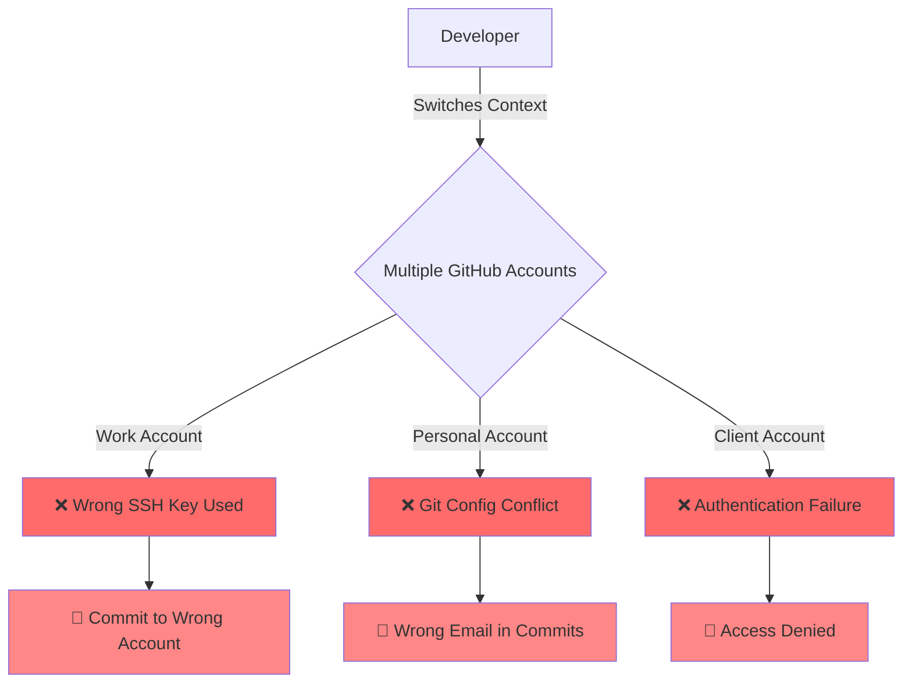
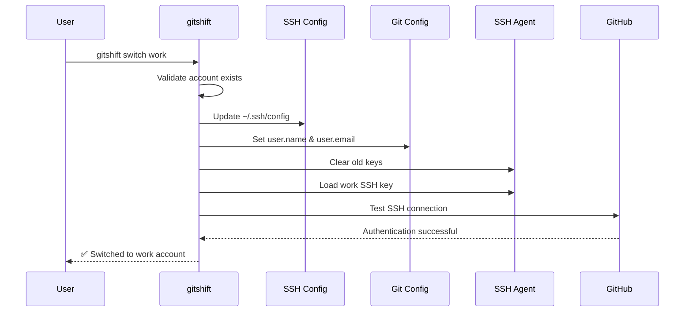
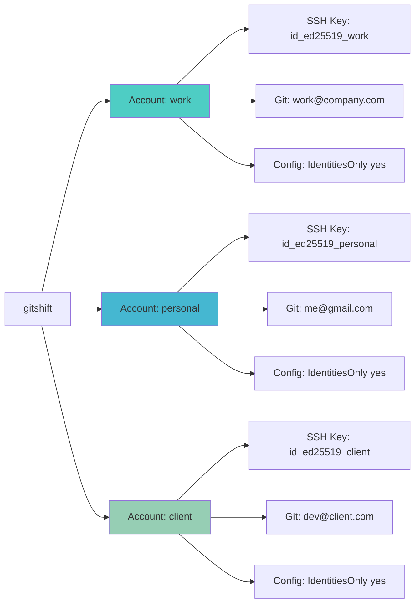
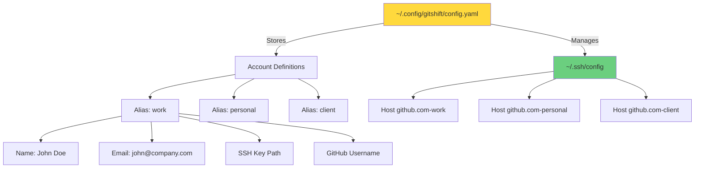
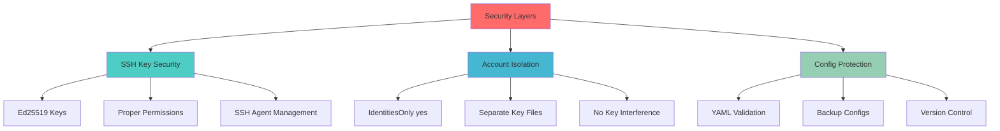
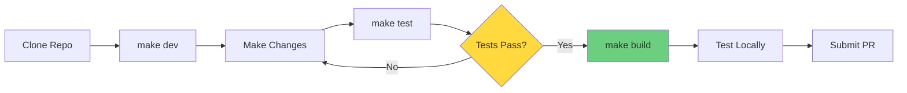

# 🎭 gitshift

<div align="center">

**SSH-First GitHub Account Management - Clean, Fast, and Isolated**

[](https://golang.org/doc/devel/release.html)
[](https://opensource.org/licenses/MIT)
[](#)

[Features](#-features) •
[Installation](#-installation) •
[Quick Start](#-quick-start) •
[Documentation](#-documentation) •
[Contributing](#-contributing)

</div>

---

## 📋 Table of Contents

- [Overview](#-overview)
- [The Problem](#-the-problem-we-solve)
- [Features](#-features)
- [How It Works](#-how-it-works)
- [Installation](#-installation)
- [Quick Start](#-quick-start)
- [Core Commands](#-core-commands)
- [Architecture](#-architecture)
- [Security](#-security)
- [Development](#-development)
- [Documentation](#-documentation)
- [Contributing](#-contributing)
- [License](#-license)

---

## 🎯 Overview

**gitshift** is a clean, focused CLI tool for managing multiple GitHub accounts with **complete SSH isolation**. No GitHub API dependencies, no complex TUI interfaces - just pure SSH-based account management that works.

### Why gitshift?

Managing multiple GitHub accounts (work, personal, client projects) traditionally requires:
- Manual SSH config editing
- Complex git configuration management
- Constant context switching
- Risk of pushing to wrong accounts
- SSH key conflicts and authentication failures

**gitshift eliminates all of this** with a simple, SSH-first approach.

---

## 🚨 The Problem We Solve



### Common Pain Points

| Problem | Impact | gitshift Solution |
|---------|--------|-------------------|
| 🔄 **Manual switching** | Time-consuming, error-prone | One command: `gitshift switch work` |
| 🔑 **SSH key conflicts** | Authentication failures | Complete isolation with `IdentitiesOnly=yes` |
| 😤 **Wrong commits** | Professional embarrassment | Auto-configures Git user per account |
| 🚫 **Key interference** | Debugging SSH issues | SSH agent management per account |
| 📁 **Complex SSH setup** | Steep learning curve | Auto-generates and manages configs |
| 🤔 **Hard to manage** | Brittle configurations | Single YAML configuration file |

---

## ✨ Features

### Core Capabilities

- 🔐 **SSH-Only Approach** - No GitHub API dependencies required
- 🔄 **Complete Isolation** - Accounts never interfere with each other
- 🔑 **Smart SSH Management** - Auto-generates and manages SSH keys
- ⚡ **Fast Switching** - Instant account transitions with validation
- 🛡️ **Secure by Design** - SSH config with `IdentitiesOnly=yes`
- 🌐 **Known Hosts Management** - Auto-manages GitHub host keys
- 📋 **Auto Key Management** - Adds keys to ssh-agent and clipboard
- 🔍 **Account Discovery** - Finds existing SSH keys automatically

### Implemented Commands

All features documented below are **verified and implemented** in the codebase:

| Command | Status | File Reference |
|---------|--------|----------------|
| `gitshift add` | ✅ Implemented | [`cmd/add.go`](cmd/add.go) |
| `gitshift list` | ✅ Implemented | [`cmd/list.go`](cmd/list.go) |
| `gitshift switch` | ✅ Implemented | [`cmd/switch.go`](cmd/switch.go) |
| `gitshift current` | ✅ Implemented | [`cmd/current.go`](cmd/current.go) |
| `gitshift remove` | ✅ Implemented | [`cmd/remove.go`](cmd/remove.go) |
| `gitshift update` | ✅ Implemented | [`cmd/update.go`](cmd/update.go) |
| `gitshift discover` | ✅ Implemented | [`cmd/discover.go`](cmd/discover.go) |
| `gitshift ssh-keygen` | ✅ Implemented | [`cmd/ssh-keygen.go`](cmd/ssh-keygen.go) |
| `gitshift ssh-test` | ✅ Implemented | [`cmd/ssh-test.go`](cmd/ssh-test.go) |

---

## 🔄 How It Works

### Account Switching Flow



### SSH Isolation Strategy



### Configuration Management



---

## 🚀 Installation

### From Source

```bash
# Clone the repository
git clone https://github.com/techishthoughts-org/gitshift.git
cd gitshift

# Build the binary
make build

# Install system-wide (optional)
sudo make install
```

### Using Go

```bash
go install github.com/techishthoughts/gitshift@latest
```

### Verify Installation

```bash
# Check version
gitshift --version

# Get help
gitshift --help
```

---

## ⚡ Quick Start

### 1. Discover Existing SSH Keys

```bash
gitshift discover
```

This scans `~/.ssh/` for existing GitHub SSH keys and helps you set up accounts.

### 2. Generate a New SSH Key

```bash
# Generate Ed25519 key (recommended)
gitshift ssh-keygen work --email work@company.com

# Features:
# ✅ Auto-adds key to ssh-agent
# ✅ Copies public key to clipboard
# ✅ Displays key for verification
```

**Verified in code**: [`cmd/ssh-keygen.go:95-130`](cmd/ssh-keygen.go#L95-L130)

### 3. Add GitHub Accounts

```bash
# Add work account
gitshift add work \
  --name "John Doe" \
  --email "john@company.com" \
  --github-username "john-work"

# Add personal account
gitshift add personal \
  --name "John Doe" \
  --email "john@gmail.com" \
  --github-username "johndoe"
```

**Verified in code**: [`cmd/add.go:16-50`](cmd/add.go#L16-L50)

### 4. List Accounts

```bash
gitshift list
```

Output:
```
📋 Configured Accounts:

🟢 work (active)
   Name: John Doe
   Email: john@company.com
   GitHub: @john-work
   SSH Key: ~/.ssh/id_ed25519_work

⚪ personal
   Name: John Doe
   Email: john@gmail.com
   GitHub: @johndoe
   SSH Key: ~/.ssh/id_ed25519_personal
```

**Verified in code**: [`cmd/list.go:14-50`](cmd/list.go#L14-L50)

### 5. Switch Accounts

```bash
# Switch to work account
gitshift switch work

# Switch to personal account
gitshift switch personal
```

**Verified in code**: [`cmd/switch.go:18-45`](cmd/switch.go#L18-L45)

### 6. Check Current Account

```bash
gitshift current
```

**Verified in code**: [`cmd/current.go`](cmd/current.go)

### 7. Test SSH Connection

```bash
# Test current account
gitshift ssh-test

# Test specific account
gitshift ssh-test work --verbose
```

**Verified in code**: [`cmd/ssh-test.go`](cmd/ssh-test.go)

---

## 🔧 Core Commands

### Account Management

#### `gitshift add [alias]`
Add a new GitHub account to the configuration.

```bash
# Interactive mode
gitshift add work

# Non-interactive with all flags
gitshift add work \
  --name "Work User" \
  --email "work@company.com" \
  --github-username "workuser" \
  --ssh-key "~/.ssh/id_ed25519_work"
```

**Required fields**: alias, name, email, github-username
**Implementation**: [`cmd/add.go`](cmd/add.go)

#### `gitshift list`
List all configured GitHub accounts.

```bash
# Simple list
gitshift list

# Alias: ls
gitshift ls
```

**Implementation**: [`cmd/list.go`](cmd/list.go)

#### `gitshift switch [account-alias]`
Switch to a different GitHub account.

```bash
gitshift switch work
```

**What happens**:
1. Validates account exists
2. Updates SSH configuration
3. Updates Git user.name and user.email
4. Manages SSH agent keys
5. Tests SSH connection to GitHub
6. Confirms switch success

**Implementation**: [`cmd/switch.go`](cmd/switch.go)

#### `gitshift current`
Show the currently active account.

```bash
gitshift current
```

**Implementation**: [`cmd/current.go`](cmd/current.go)

#### `gitshift remove [alias]`
Remove an account from configuration.

```bash
gitshift remove oldaccount
```

**Implementation**: [`cmd/remove.go`](cmd/remove.go)

#### `gitshift update [alias]`
Update account information.

```bash
gitshift update work --email "newemail@company.com"
```

**Implementation**: [`cmd/update.go`](cmd/update.go)

---

### SSH Key Management

#### `gitshift ssh-keygen [alias]`
Generate SSH keys for an account.

```bash
# Generate Ed25519 key (default)
gitshift ssh-keygen work --email work@company.com

# Generate RSA key
gitshift ssh-keygen work --type rsa --bits 4096

# With passphrase
gitshift ssh-keygen work --passphrase "my-secure-password"

# Force overwrite existing key
gitshift ssh-keygen work --force
```

**Features**:
- 🔑 Auto-adds key to ssh-agent
- 📋 Copies public key to clipboard (macOS: pbcopy)
- ✅ Displays key in terminal for verification

**Implementation**: [`cmd/ssh-keygen.go`](cmd/ssh-keygen.go)

#### `gitshift ssh-test [account]`
Test SSH connectivity to GitHub.

```bash
# Test current account
gitshift ssh-test

# Test specific account
gitshift ssh-test work --verbose
```

**Implementation**: [`cmd/ssh-test.go`](cmd/ssh-test.go)

#### `gitshift discover`
Auto-discover accounts from existing SSH keys.

```bash
gitshift discover
```

**Implementation**: [`cmd/discover.go`](cmd/discover.go)

---

## 🏗️ Architecture

### File Structure

```
~/.ssh/
├── id_ed25519_work          # Work account private key
├── id_ed25519_work.pub      # Work account public key
├── id_ed25519_personal      # Personal account private key
├── id_ed25519_personal.pub  # Personal account public key
├── config                   # SSH config with isolation
└── known_hosts              # GitHub host keys

~/.config/gitshift/
└── config.yaml              # gitshift configuration
```

### Configuration File Structure

```yaml
# ~/.config/gitshift/config.yaml
accounts:
  work:
    alias: work
    name: John Doe
    email: john@company.com
    ssh_key_path: /Users/john/.ssh/id_ed25519_work
    github_username: john-work
    description: Work GitHub account
    is_default: false
    status: active
    created_at: "2025-01-15T10:30:00Z"
    last_used: "2025-01-16T09:15:00Z"

  personal:
    alias: personal
    name: John Doe
    email: john@gmail.com
    ssh_key_path: /Users/john/.ssh/id_ed25519_personal
    github_username: johndoe
    description: Personal GitHub account
    is_default: true
    status: active
    created_at: "2025-01-15T11:00:00Z"
    last_used: "2025-01-16T08:45:00Z"

current_account: work
global_git_config: true
auto_detect: true
config_version: "1.0.0"
```

**Implementation**: [`internal/config/config.go`](internal/config/config.go)

### SSH Config Structure

gitshift generates SSH config entries with complete isolation:

```ssh
# Work account
Host github.com-work
    HostName github.com
    User git
    IdentityFile ~/.ssh/id_ed25519_work
    IdentitiesOnly yes

# Personal account
Host github.com-personal
    HostName github.com
    User git
    IdentityFile ~/.ssh/id_ed25519_personal
    IdentitiesOnly yes
```

**Implementation**: [`internal/ssh/`](internal/ssh/)

### Project Structure

```
gitshift/
├── cmd/                    # CLI commands (Cobra)
│   ├── add.go             # Add account
│   ├── current.go         # Show current account
│   ├── discover.go        # SSH key discovery
│   ├── list.go            # List accounts
│   ├── remove.go          # Remove account
│   ├── root.go            # Root command
│   ├── ssh-keygen.go      # Generate SSH keys
│   ├── ssh-test.go        # Test SSH connection
│   ├── switch.go          # Switch accounts
│   └── update.go          # Update account
├── internal/              # Internal packages
│   ├── config/           # Configuration management
│   ├── discovery/        # SSH-only discovery
│   ├── git/              # Git operations
│   ├── models/           # Data models
│   └── ssh/              # SSH management
├── docs/                 # Documentation
├── main.go               # Entry point
└── go.mod                # Go module definition
```

---

## 🔒 Security

### SSH Security Features

- **Ed25519 keys by default** - Most secure and performant key type
- **Proper permissions** - 600 for private keys, 644 for public keys
- **IdentitiesOnly=yes** - Prevents SSH key leakage
- **Current GitHub host keys** - Up-to-date for 2025
- **SSH agent isolation** - Only loads required keys

### Account Isolation

- **Complete SSH isolation** - No cross-account contamination
- **Separate SSH keys** - One key per account
- **Config validation** - Ensures proper setup
- **SSH agent clearing** - Removes old keys before loading new ones

### Security Best Practices



For complete security documentation, see [SECURITY.md](docs/SECURITY.md)

---

## 🛠️ Development

### Prerequisites

- **Go 1.23+** - [Download Go](https://golang.org/dl/)
- **Git** - [Download Git](https://git-scm.com/downloads)
- **Make** - Build automation

### Build from Source

```bash
# Clone repository
git clone https://github.com/techishthoughts-org/gitshift.git
cd gitshift

# Install dependencies
go mod download

# Run full development workflow
make dev

# Build binary
make build

# Run tests
make test

# Run linter
make lint
```

### Available Make Targets

```bash
make build      # Build the binary
make test       # Run tests
make dev        # Full development workflow (fmt, vet, build, test)
make demo       # Show gitshift in action
make clean      # Clean build artifacts
make release    # Cross-platform release builds
make install    # Install system-wide
```

### Development Workflow



---

## 📚 Documentation

### Complete Documentation

- **[User Guide](docs/USER_GUIDE.md)** - Complete user documentation
- **[Configuration Guide](docs/CONFIGURATION.md)** - Detailed configuration options
- **[Architecture Guide](docs/ARCHITECTURE.md)** - Technical architecture and design
- **[Security Guide](docs/SECURITY.md)** - Security best practices
- **[Troubleshooting Guide](docs/TROUBLESHOOTING.md)** - Common issues and solutions
- **[Contributing Guide](docs/CONTRIBUTING.md)** - How to contribute
- **[Migration Guide](docs/MIGRATION_GUIDE.md)** - Migrating from other tools

### Quick Links

- [Installation](#-installation)
- [Quick Start](#-quick-start)
- [Core Commands](#-core-commands)
- [Architecture](#-architecture)

---

## 🤝 Contributing

We welcome contributions! Here's how to get started:

### Ways to Contribute

- 🐛 **Bug Reports** - Report issues you encounter
- ✨ **Feature Requests** - Suggest new features
- 💻 **Code Contributions** - Submit bug fixes and features
- 📚 **Documentation** - Improve documentation and examples
- 🧪 **Testing** - Help us test and improve quality

### Getting Started

1. **Fork the repository** on GitHub
2. **Clone your fork**:
   ```bash
   git clone https://github.com/YOUR_USERNAME/gitshift.git
   cd gitshift
   ```
3. **Add upstream remote**:
   ```bash
   git remote add upstream https://github.com/techishthoughts-org/gitshift.git
   ```
4. **Create a feature branch**:
   ```bash
   git checkout -b feature/amazing-feature
   ```
5. **Make changes and test**:
   ```bash
   make dev
   ```
6. **Commit your changes**:
   ```bash
   git commit -m 'Add amazing feature'
   ```
7. **Push to your fork**:
   ```bash
   git push origin feature/amazing-feature
   ```
8. **Open a Pull Request**

### Development Guidelines

- Follow Go best practices and conventions
- Write tests for new features
- Update documentation as needed
- Run `make dev` before committing
- Use semantic commit messages

For detailed guidelines, see [CONTRIBUTING.md](docs/CONTRIBUTING.md)

---

## 📄 License

MIT License - see [LICENSE](LICENSE) file for details.

---

## 🙏 Acknowledgments

- Built with ❤️ for developers managing multiple GitHub accounts
- Inspired by the need for **simple, secure, SSH-first** account management
- Thanks to the Go community for excellent CLI tools and libraries

---

## 📞 Support & Community

### Get Help

- 🐛 **Report Bugs**: [GitHub Issues](https://github.com/techishthoughts-org/gitshift/issues)
- 💬 **Community Support**: [GitHub Discussions](https://github.com/techishthoughts-org/gitshift/discussions)
- 📧 **Contact**: techishthoughts@gmail.com

### Stay Connected

- ⭐ **Star the repo** to show your support
- 👁️ **Watch** for updates and releases
- 🍴 **Fork** to contribute

---

<div align="center">

**gitshift: Where SSH simplicity meets GitHub productivity** 🎭✨

Made with ❤️ by the [techishthoughts](https://github.com/techishthoughts-org) team

</div>
