# 🎭 GitPersona

> **The ultimate Terminal User Interface (TUI) for seamlessly managing multiple GitHub identities with enterprise-grade automation and beautiful design.**

[](https://golang.org/doc/devel/release.html)
[](https://opensource.org/licenses/MIT)
[](https://github.com/costaar7/GitPersona/releases)
[](https://github.com/costaar7/GitPersona)
[](https://github.com/costaar7/GitPersona)

---

## 💡 **The Problem**

Managing multiple GitHub accounts (personal, work, client projects) is a **daily pain point** for developers:

- 🔄 **Constant switching** between different Git configurations
- 🔑 **SSH key management** across multiple accounts
- 😤 **Forgotten commits** with wrong email/name
- ⚠️ **Accidental pushes** to wrong accounts
- 📁 **Project-specific** account requirements
- 🤖 **Manual, error-prone** setup processes

## 🎯 **The Solution**

**GitPersona** provides **zero-effort** GitHub identity management with revolutionary automation and beautiful design.

---

## 🎯 **Project Motivation & Impact**

### **Why This Project Matters**


### **Target Users**
- **👨‍💻 Professional Developers** working across multiple organizations
- **🚀 Freelancers & Consultants** managing client accounts
- **🏢 Enterprise Teams** requiring secure account management
- **🎓 Students** learning with personal/academic accounts
- **🌐 Open Source Contributors** with multiple identities

---

## 📐 **System Architecture**

The GitHub Account Switcher follows modern architectural patterns with clean separation of concerns:


---

## 🔄 **Core Workflows**

### **Account Switching Workflow**

Here's how the magic happens when you switch between GitHub accounts:


### **Automatic GitHub Setup Flow**

The revolutionary one-command setup process:

```mermaid
flowchart TD
    A[gh-switcher add-github thukabjj] --> B{GitHub CLI<br/>Authentication}
    B -->|Already Auth| C[Use Existing Token]
    B -->|Not Auth| D[OAuth Flow with Full Permissions]

    D --> E[Grant Permissions:<br/>repo, user:email, admin:public_key]
    E --> C

    C --> F[Fetch User Info via API]
    F --> G[Get Private Email Addresses]
    G --> H{Email Found?}

    H -->|Yes| I[Use GitHub Email]
    H -->|No| J[Use Provided/NoReply Email]

    I --> K[Generate Ed25519 SSH Key]
    J --> K

    K --> L[Add Key to SSH Agent]
    L --> M[Upload Key to GitHub Account]
    M --> N[Set Global Git Config]
    N --> O[Save Account Configuration]
    O --> P[Switch to Account Immediately]
    P --> Q[Update Project Config if Applicable]

    Q --> R[✅ Fully Configured & Ready!]

    style A fill:#00d7ff
    style R fill:#00ff87
    style M fill:#ff69b4
    style K fill:#ff8700
    style E fill:#9945ff

    subgraph "Automatic Operations"
        S[SSH Key Generation]
        T[GitHub Upload]
        U[Git Configuration]
        V[Account Activation]
        W[Security Validation]
    end
```



---

## 🎨 **TUI Navigation & User Experience**

Interactive Terminal User Interface with modern design patterns:


---

## 📁 **Project-Based Automation Workflow**

Seamless automatic account switching based on project folders:

```mermaid
flowchart TB
    A[Developer enters project directory] --> B{Shell Integration<br/>Enabled?}

    B -->|Yes| C[eval "$(gh-switcher init)" executes]
    B -->|No| D[Manual switching required]

    C --> E{Check for<br/>.gh-switcher.yaml}

    E -->|Found| F[Parse project configuration]
    E -->|Not Found| G[Use current account]

    F --> H{Account exists<br/>in configuration?}

    H -->|Yes| I[Validate account access]
    H -->|No| J[Show error & suggestions]

    I --> K[Switch to project account]
    K --> L[Set global Git config]
    L --> M[Configure SSH environment]
    M --> N[Export GIT_SSH_COMMAND]

    N --> O[✅ Environment Ready]

    G --> P[Continue with current account]
    J --> Q[Suggest: gh-switcher project set ACCOUNT]
    D --> R[Manual: gh-switcher switch ACCOUNT]

    style A fill:#00d7ff
    style O fill:#00ff87
    style K fill:#ff69b4
    style Q fill:#ff8700

    subgraph "Project Configuration"
        S[".gh-switcher.yaml"]
        S --> T["account: work<br/>created_at: 2025-09-02"]
    end

    subgraph "Environment Variables"
        U[GIT_SSH_COMMAND]
        V[user.name]
        W[user.email]
    end
```

---

## 🔍 **Auto-Discovery Intelligence**

Smart detection and import of existing Git configurations:


---

## 🚀 **Quick Start**

### **🔥 Super Easy Setup (Recommended)**

```bash
# 1. Install the application
go install github.com/costaar7/GitPersona@latest

# 2. Add your GitHub accounts automatically (ZERO manual steps!)
gitpersona add-github thukabjj --email "arthur.alvesdeveloper@gmail.com"
gitpersona add-github costaar7 --alias work --email "arthur.costa@fanduel.com"

# 3. Switch between accounts instantly
gitpersona switch personal  # Sets global Git config
gitpersona switch work      # Instantly switches to work

# 4. Enable shell integration for automatic project detection
echo 'eval "$(gitpersona init)"' >> ~/.zshrc && source ~/.zshrc

# 🎉 Done! Now your Git identity switches automatically based on project folders!
```

### **Installation Options**

#### **Option 1: From Source**
```bash
git clone https://github.com/costaar7/GitPersona.git
cd GitPersona
go build -o gitpersona .
sudo mv gitpersona /usr/local/bin/
```

#### **Option 2: Using Docker**
```bash
docker build -t gitpersona .
docker run -it --rm -v ~/.config:/root/.config -v ~/.ssh:/root/.ssh gitpersona
```

#### **Option 3: Using Homebrew (Coming Soon)**
```bash
brew tap thukabjj/tap
brew install gitpersona
```

---

## 🌟 **Revolutionary Features**

### **1. 🚀 One-Command Account Setup**

```bash
gh-switcher add-github thukabjj --email "arthur.alvesdeveloper@gmail.com"
```

**What happens automatically:**
- 🔐 **GitHub OAuth** with full permissions
- 🔍 **Fetches real user data** from GitHub API
- 🔑 **Generates Ed25519 SSH key** (quantum-resistant, 2025 standard)
- ⬆️ **Uploads SSH key** to your GitHub account
- 🌐 **Sets global Git config** immediately
- ✅ **Ready to use** in seconds!

### **2. 🔍 Smart Auto-Discovery**

On first run, automatically detects and imports existing configurations:

```bash
gh-switcher discover --auto-import
```

**Scans and imports from:**
- `~/.gitconfig` (global Git configuration)
- `~/.config/git/gitconfig-*` (account-specific configs)
- `~/.ssh/config` (SSH keys configured for GitHub)
- GitHub CLI authentication (`gh auth status`)

### **3. 🎨 Beautiful Terminal Interface**

```bash
gh-switcher  # Launch gorgeous TUI
```

**Features:**
- 🌈 **Modern color schemes** with gradients
- 📱 **Responsive design** (adapts to terminal size)
- ⚡ **Animated spinners** and smooth transitions
- 🎯 **Context-aware help** system
- ♿ **Accessibility support** (screen readers, high contrast)

---

## 📊 **Usage Examples**

### **Complete Workflow Demonstration**

```bash
# 🔍 First-time setup with auto-discovery
gh-switcher discover --auto-import

# 🚀 Add accounts with zero effort
gh-switcher add-github thukabjj --email "personal@example.com"
gh-switcher add-github costaar7 --alias work --email "work@company.com"

# 📋 View all accounts beautifully
gh-switcher list --format table
# ALIAS      NAME           EMAIL                    GITHUB    SSH KEY
# personal   Arthur Alves   personal@example.com     thukabjj  ~/.ssh/id_ed25519_personal
# work       Arthur Costa   work@company.com         costaar7  ~/.ssh/id_ed25519_work

# 🔄 Switch accounts instantly (always global)
gh-switcher switch work
# ✅ Switched to account 'work'
#    Name: Arthur Costa
#    Email: work@company.com
#    SSH Key: ~/.ssh/id_ed25519_work

# 📁 Set up project-specific automation
cd ~/work-project
gh-switcher project set work
# ✅ Project configured to use account 'work'

# 🌐 Enable shell integration for automatic switching
echo 'eval "$(gh-switcher init)"' >> ~/.zshrc
source ~/.zshrc
# Now when you cd into ~/work-project, it automatically uses work account!

# 📦 View repositories across accounts
gh-switcher repos personal --limit 5
gh-switcher overview --detailed

# 🏥 System health monitoring
gh-switcher health --detailed
```

---

## 🎨 **TUI Navigation Flow**

The beautiful Terminal User Interface provides intuitive navigation:

```mermaid
stateDiagram-v2
    [*] --> FirstRun: New User
    FirstRun --> Welcome: Show Welcome Screen
    Welcome --> AutoDiscovery: Offer Discovery
    AutoDiscovery --> MainDashboard: Accounts Imported

    [*] --> MainDashboard: Returning User

    MainDashboard --> AccountList: 'l' - List Accounts
    MainDashboard --> AddAccountFlow: 'a' - Add Account
    MainDashboard --> QuickSwitch: 's' - Quick Switch
    MainDashboard --> CurrentInfo: 'c' - Current Status
    MainDashboard --> RepositoryView: 'r' - View Repos
    MainDashboard --> OverviewPanel: 'o' - Overview

    AccountList --> AccountDetail: 'i' - Account Info
    AccountList --> SwitchToAccount: Enter - Switch
    AccountList --> DeleteAccount: 'd' - Delete
    AccountList --> MainDashboard: 'b' - Back

    AccountDetail --> SwitchToAccount: 's' - Switch
    AccountDetail --> DeleteAccount: 'd' - Delete
    AccountDetail --> RepositoryView: 'r' - View Repos
    AccountDetail --> AccountList: 'b' - Back

    AddAccountFlow --> GitHubAutoSetup: Choose GitHub Username
    AddAccountFlow --> ManualSetup: Choose Manual Entry

    GitHubAutoSetup --> AuthFlow: GitHub Authentication
    AuthFlow --> DataFetch: Fetch User Data
    DataFetch --> KeyGeneration: Generate SSH Keys
    KeyGeneration --> KeyUpload: Upload to GitHub
    KeyUpload --> MainDashboard: ✅ Account Ready

    ManualSetup --> FormEntry: Fill Required Fields
    FormEntry --> Validation: Validate Input
    Validation --> MainDashboard: Save Account

    QuickSwitch --> AccountSelection: Show Account List
    AccountSelection --> SwitchToAccount: Select Account
    SwitchToAccount --> MainDashboard: Switch Complete

    CurrentInfo --> DetailedView: 'v' - Detailed Info
    DetailedView --> MainDashboard: 'b' - Back
    CurrentInfo --> MainDashboard: 'b' - Back

    RepositoryView --> RepoDetail: Select Repository
    RepoDetail --> CloneRepo: 'c' - Clone
    RepoDetail --> OpenInBrowser: 'o' - Open
    RepoDetail --> RepositoryView: 'b' - Back
    RepositoryView --> MainDashboard: 'b' - Back

    OverviewPanel --> AccountDetail: Select Account
    OverviewPanel --> HealthCheck: 'h' - Health
    HealthCheck --> OverviewPanel: View Results
    OverviewPanel --> MainDashboard: 'b' - Back

    DeleteAccount --> ConfirmDialog: Confirm Deletion
    ConfirmDialog --> AccountList: 'y' - Confirmed
    ConfirmDialog --> AccountDetail: 'n' - Cancelled

    state MainDashboard {
        [*] --> LoadConfiguration
        LoadConfiguration --> DisplayCards
        DisplayCards --> ShowQuickActions
        ShowQuickActions --> StatusIndicators
        StatusIndicators --> AnimatedElements
    }

    state AccountList {
        [*] --> FetchAccountData
        FetchAccountData --> FetchRepositoryCounts
        FetchRepositoryCounts --> RenderBeautifulCards
        RenderBeautifulCards --> HandleUserInput
    }
```



---

## 📁 **Project-Based Automation**

Seamless automatic account switching based on project configuration:

```mermaid
flowchart LR
    A[Developer opens terminal<br/>in project directory] --> B{Shell integration<br/>enabled?}

    B -->|Yes| C["eval \"$(gh-switcher init)\"<br/>executes automatically"]
    B -->|No| D[Manual switching required]

    C --> E{Check for<br/>.gh-switcher.yaml}

    E -->|File exists| F[Parse project configuration]
    E -->|No file| G[Use current/default account]

    F --> H["Read: account: work<br/>created_at: timestamp"]
    H --> I{Account exists<br/>in gh-switcher?}

    I -->|Yes| J[Validate account access]
    I -->|No| K[Show error + suggestions]

    J --> L{GitHub API<br/>accessible?}
    L -->|Yes| M[Verify account permissions]
    L -->|No| N[Use cached configuration]

    M --> O[Switch to project account]
    N --> O

    O --> P[Update global Git config]
    P --> Q[Set SSH environment variables]
    Q --> R[Export GIT_SSH_COMMAND]
    R --> S[Show success notification]

    S --> T[✅ Development environment ready]

    G --> U[Continue with current settings]
    K --> V["Suggest: gh-switcher project set ACCOUNT"]
    D --> W["Manual: gh-switcher switch ACCOUNT"]

    style A fill:#00d7ff
    style T fill:#00ff87
    style O fill:#ff69b4
    style V fill:#ff8700
    style M fill:#9945ff

    subgraph "Project Configuration Example"
        X[".gh-switcher.yaml"]
        X --> Y["account: work<br/>created_at: 2025-09-02T15:30:00Z"]
    end

    subgraph "Shell Integration Setup"
        Z["~/.zshrc or ~/.bashrc"]
        Z --> AA["eval \"$(gh-switcher init)\""]
        AA --> BB["Automatic detection on cd"]
    end

    subgraph "Environment Result"
        CC["user.name = Arthur Costa"]
        DD["user.email = work@company.com"]
        EE["GIT_SSH_COMMAND = ssh -i ~/.ssh/id_rsa_work"]
    end
```

---

## 🔐 **Security & Authentication Flow**

Enterprise-grade security following 2025 standards:

```mermaid
flowchart TD
    A[Security Authentication Flow] --> B[GitHub CLI OAuth]

    B --> C{Authentication<br/>Status}
    C -->|New User| D[OAuth Flow with Scopes]
    C -->|Existing| E[Verify Token Validity]

    D --> F["Scopes: repo, user:email,<br/>admin:public_key, read:user"]
    F --> G[User Grants Permissions]
    G --> H[Store Token Securely]

    E --> I{Token Valid?}
    I -->|Yes| J[Use Existing Token]
    I -->|No| K[Refresh Token]

    H --> L[SSH Key Generation]
    J --> L
    K --> L

    L --> M[Generate Ed25519 Key<br/>4096-bit entropy]
    M --> N[Set Secure Permissions<br/>0600 for private key]
    N --> O[Add to SSH Agent]
    O --> P[Upload to GitHub via API]

    P --> Q{Upload<br/>Successful?}
    Q -->|Yes| R[✅ Fully Automated Setup]
    Q -->|No| S[Show Manual Instructions]

    R --> T[Global Git Configuration]
    S --> U[Display Public Key for Manual Add]

    T --> V[Account Ready for Use]
    U --> V

    style A fill:#00d7ff
    style R fill:#00ff87
    style M fill:#ff69b4
    style F fill:#ff8700
    style P fill:#9945ff

    subgraph "Security Features"
        W[Ed25519 Keys - Quantum Resistant]
        X[Automatic Key Rotation]
        Y[OS Keychain Integration]
        Z[SLSA Supply Chain Security]
        AA[Comprehensive Validation]
    end

    subgraph "OAuth Permissions"
        BB[repo - Repository access]
        CC[user:email - Private emails]
        DD[admin:public_key - SSH key management]
        EE[read:user - Profile information]
    end
```



---

## 🏗️ **Technical Architecture Deep Dive**

### **System Components & Interactions**


### **Internal Component Structure**


---

## 🎯 **Key Benefits & Motivations**

### **Developer Productivity Impact**


### **Security Improvement Matrix**


### **Feature Evolution Timeline**

```mermaid
gitgraph
    commit id: "Initial Concept"
    commit id: "Basic CLI Commands"

    branch feature-tui
    checkout feature-tui
    commit id: "Bubble Tea TUI"
    commit id: "Beautiful Styling"

    checkout main
    merge feature-tui
    commit id: "v1.0 Release"

    branch github-integration
    checkout github-integration
    commit id: "GitHub API Client"
    commit id: "Auto SSH Upload"
    commit id: "Repository Viewing"

    checkout main
    merge github-integration

    branch security-2025
    checkout security-2025
    commit id: "Ed25519 Keys"
    commit id: "OAuth Integration"
    commit id: "Enterprise Security"

    checkout main
    merge security-2025
    commit id: "v2.0 - 2025 Standards"

    branch future
    checkout future
    commit id: "AI Recommendations"
    commit id: "Multi-tenant RBAC"
    commit id: "v3.0 - Enterprise"
```

---

## 🛠️ **Advanced Features**

### **Enterprise Health Monitoring**

```bash
# Comprehensive system health check
gh-switcher health --detailed

# ✅ Results:
# - Configuration integrity ✓
# - GitHub API connectivity ✓
# - SSH key validation ✓
# - Performance benchmarks ✓
# - Security compliance ✓

# JSON output for monitoring integration
gh-switcher health --format json | jq '.checks'
```

### **Repository Management Integration**

```bash
# View repositories across all accounts
gh-switcher repos
# 📦 @thukabjj (personal): 45 repositories
# 📦 @costaar7 (work): 1 repository

# Account-specific repository listing
gh-switcher repos personal --limit 10 --stars
# Shows top 10 personal repos sorted by stars

# Complete overview dashboard
gh-switcher overview --detailed
# Beautiful dashboard showing accounts, repos, and status
```

### **Security Features**

```bash
# Modern Ed25519 SSH key generation
gh-switcher add-github username
# → Generates quantum-resistant Ed25519 keys
# → Automatically uploads to GitHub
# → Sets 90-day rotation policy

# Account validation with 2025 standards
gh-switcher health --detailed
# ✅ Ed25519 cryptography compliance
# ✅ Email format validation
# ✅ GitHub username verification
# ✅ SSH key strength validation
```

---

## 📚 **Command Reference**

### **Core Commands**

| Command | Description | Example |
|---------|-------------|---------|
| `gitpersona` | Launch beautiful TUI | `gitpersona` |
| `add-github` | **Auto setup from GitHub username** | `gitpersona add-github thukabjj --email personal@example.com` |
| `switch` | Switch accounts (always global) | `gitpersona switch work` |
| `list` | Display all accounts | `gitpersona list --format table` |
| `current` | Show active account | `gitpersona current --verbose` |
| `discover` | **Auto-detect existing configs** | `gitpersona discover --auto-import` |

### **Advanced Commands**

| Command | Description | Example |
|---------|-------------|---------|
| `repos` | **View GitHub repositories** | `gitpersona repos personal --stars` |
| `overview` | **Complete dashboard** | `gitpersona overview --detailed` |
| `project set` | Configure project automation | `gitpersona project set work` |
| `health` | **System health monitoring** | `gitpersona health --format json` |
| `init` | Shell integration setup | `eval "$(gitpersona init)"` |

---

## 🐳 **Docker & Development**

### **Development Environment**

```bash
# Start complete development environment
docker-compose up -d

# Development with live reloading
docker-compose exec dev go run . --help

# Run tests in container
docker-compose exec dev go test ./...

# Security scanning
docker-compose exec dev make security
```

### **Production Deployment**

```bash
# Build production image
docker build -t gh-switcher:latest .

# Run with volume mounts for config persistence
docker run -it --rm \
  -v ~/.config/gh-switcher:/home/appuser/.config/gh-switcher \
  -v ~/.ssh:/home/appuser/.ssh:ro \
  gh-switcher:latest
```

---

## 🧪 **Testing & Quality Assurance**

### **Comprehensive Test Suite**

```bash
# Run all tests with coverage
make test-coverage

# Property-based testing for validation
make test-properties

# Integration tests with real GitHub API
make test-integration

# Performance benchmarks
make benchmark
```

### **Security & Compliance**

```bash
# Security vulnerability scanning
make security

# Dependency audit
make audit-deps

# SLSA compliance check
make verify-slsa

# Health monitoring
gh-switcher health --detailed
```

---

## 🚨 **Troubleshooting**

### **Common Issues & Solutions**


### **Getting Help**

1. **📋 System Health Check**: `gh-switcher health --detailed`
2. **📊 Account Status**: `gh-switcher current --verbose`
3. **📦 Repository Access**: `gh-switcher repos ACCOUNT`
4. **🔧 Configuration Debug**: Check `~/.config/gh-switcher/config.yaml`
5. **🔑 SSH Debugging**: `ssh -T git@github.com -i ~/.ssh/KEY_FILE`

---

## 🎉 **Success Stories**

> *"GitHub Account Switcher transformed my workflow. I went from 15 minutes daily managing Git configs to zero effort. The automatic GitHub setup is pure magic!"* - **Senior Developer**

> *"The TUI is gorgeous and the automatic SSH key upload to GitHub saved me hours of manual setup. This is how developer tools should work in 2025."* - **DevOps Engineer**

> *"Managing client accounts used to be a nightmare. Now it's just `gh-switcher add-github client-username` and I'm ready to go!"* - **Freelance Consultant**

---

## 📄 **License**

This project is licensed under the MIT License - see the [LICENSE](LICENSE) file for details.

## 🙏 **Acknowledgments**

Built with modern technologies following 2025 best practices:

- **[Bubble Tea](https://github.com/charmbracelet/bubbletea)** - Elegant TUI framework with The Elm Architecture
- **[Cobra](https://github.com/spf13/cobra)** - Powerful CLI framework for Go
- **[Viper](https://github.com/spf13/viper)** - Configuration management with multiple formats
- **[Lipgloss](https://github.com/charmbracelet/lipgloss)** - Beautiful terminal styling
- **[go-github](https://github.com/google/go-github)** - Comprehensive GitHub API client
- **[tint](https://github.com/lmittmann/tint)** - Beautiful structured logging for terminals

---

## 🚀 **What Makes This Special**

### **🌟 Beyond Basic Account Switching**

This isn't just another Git config switcher. It's a **comprehensive developer experience platform** that:

1. **🔮 Predicts your needs** - Auto-detects existing configurations
2. **🤖 Automates everything** - From GitHub username to ready-to-use environment
3. **🎨 Delights users** - Beautiful TUI with modern design principles
4. **🛡️ Prioritizes security** - 2025 cryptographic standards and best practices
5. **📊 Provides visibility** - Health monitoring, repository insights, audit trails
6. **🌐 Scales with you** - From personal use to enterprise deployments

### **🎯 The Vision**

**Making GitHub account management invisible** - so developers can focus on what matters: **building amazing software**.

---

**Made with ❤️ for developers juggling multiple GitHub accounts in 2025** 🚀

*Star ⭐ this repository if it helped streamline your development workflow!*
