# 🎭 gitshift

<div align="center">

**SSH-First Multi-Platform Git Account Manager**

*Seamlessly manage GitHub, GitLab, GitHub Enterprise, and self-hosted Git accounts with complete SSH isolation*

[](https://golang.org/doc/devel/release.html)
[](https://opensource.org/licenses/MIT)
[](#)

[Features](#-features) •
[Multi-Platform](#-multi-platform-strategy) •
[Installation](#-installation) •
[Quick Start](#-quick-start) •
[Documentation](#-documentation)

</div>

---

## 📋 Table of Contents

- [Overview](#-overview)
- [The Problem](#-the-problem-we-solve)
- [Multi-Platform Strategy](#-multi-platform-strategy)
- [Features](#-features)
- [How It Works](#-how-it-works)
- [Installation](#-installation)
- [Quick Start](#-quick-start)
- [Multi-Platform Examples](#-multi-platform-examples)
- [Core Commands](#-core-commands)
- [Architecture](#-architecture)
- [Security](#-security)
- [Documentation](#-documentation)
- [Contributing](#-contributing)
- [License](#-license)

---

## 🎯 Overview

**gitshift** is a powerful CLI tool for managing multiple Git accounts across **GitHub, GitLab, GitHub Enterprise, and self-hosted Git platforms** with **complete SSH isolation**.

### Why gitshift?

Managing multiple Git accounts across different platforms (work GitHub, personal GitLab, client GitLab, GitHub Enterprise) traditionally requires:
- ❌ Manual SSH config editing for each platform
- ❌ Complex git configuration management
- ❌ Constant context switching between accounts
- ❌ Risk of pushing to wrong accounts
- ❌ SSH key conflicts and authentication failures
- ❌ Platform-specific authentication setup

**✅ gitshift eliminates all of this** with a simple, SSH-first, multi-platform approach.

### Key Differentiators

🌍 **True Multi-Platform** - Not just GitHub! Full support for GitLab, GitHub Enterprise, and self-hosted instances
🔐 **SSH-First** - No API dependencies required, works everywhere
🚀 **Zero Configuration Complexity** - One command to switch, automatic SSH management
⚡ **Instant Switching** - Sub-second account transitions with validation
🛡️ **Complete Isolation** - Platform-specific SSH configs prevent key conflicts
🎯 **Auto-Detection** - Automatically detects platform from repository URLs

---

## 🚨 The Problem We Solve

### Before gitshift

```mermaid
graph TD
    A[Developer with Multiple Accounts] --> B{Manual SSH Management}
    B -->|Work GitHub| C[Edit ~/.ssh/config manually]
    B -->|Personal GitLab| D[Update Git global config]
    B -->|Client GitHub Enterprise| E[Remember which key to use]

    C --> F[❌ Wrong SSH key used]
    D --> G[❌ Git config conflicts]
    E --> H[❌ Authentication failures]

    F --> I[😤 Commits to wrong repo]
    G --> J[😤 Wrong author in commits]
    H --> K[😤 Access denied errors]

    style F fill:#ff6b6b
    style G fill:#ff6b6b
    style H fill:#ff6b6b
    style I fill:#ff8787
    style J fill:#ff8787
    style K fill:#ff8787
```



### After gitshift

```mermaid
graph LR
    A[Developer] -->|One Command| B[gitshift switch work]
    B --> C[✅ Automatic SSH Config]
    B --> D[✅ Automatic Git Config]
    B --> E[✅ Platform Detection]

    C --> F[🎉 Perfect Isolation]
    D --> F
    E --> F

    style B fill:#4ecdc4
    style F fill:#95e1d3
```



### Common Pain Points

| Problem | Impact | gitshift Solution |
|---------|--------|-------------------|
| 🌍 **Multiple Platforms** | Different SSH/API per platform | Unified CLI for all platforms |
| 🔄 **Manual Switching** | Time-consuming, error-prone | One command: `gitshift switch work` |
| 🔑 **SSH Key Conflicts** | Authentication failures | Complete isolation with `IdentitiesOnly=yes` |
| 😤 **Wrong Commits** | Professional embarrassment | Auto-configures Git user per account |
| 🏢 **Enterprise Support** | Complex custom domain setup | First-class enterprise domain support |
| 📁 **Configuration Hell** | Brittle, hard-to-maintain configs | Single YAML configuration file |

---

## 🌍 Multi-Platform Strategy

gitshift was designed from the ground up to support multiple Git hosting platforms, not just GitHub.

### Supported Platforms

| Platform | Status | SSH Support | API Support | Custom Domains | Notes |
|----------|--------|-------------|-------------|----------------|-------|
| **GitHub** | ✅ Full | ✅ Complete | ✅ Complete | ✅ Yes | github.com |
| **GitHub Enterprise** | ✅ Full | ✅ Complete | ✅ Complete | ✅ Yes | Custom domains fully supported |
| **GitLab** | ✅ Full | ✅ Complete | ✅ Complete | ✅ Yes | gitlab.com |
| **GitLab Self-Hosted** | ✅ Full | ✅ Complete | ✅ Complete | ✅ Yes | Any custom domain |
| **Bitbucket** | 🚧 Planned | - | - | - | Coming soon |
| **Gitea** | 🚧 Planned | - | - | - | Coming soon |

### Platform Architecture


### Platform-Specific Configuration

Each platform has its own SSH host entry and configuration:

```yaml
# GitHub account
personal-github:
  alias: personal-github
  platform: github          # Platform type
  domain: github.com        # Platform domain (optional for defaults)
  username: johndoe         # Platform username
  email: john@personal.com
  ssh_key_path: ~/.ssh/id_ed25519_github_personal

# GitLab account
personal-gitlab:
  alias: personal-gitlab
  platform: gitlab          # Different platform
  domain: gitlab.com
  username: johndoe
  email: john@personal.com
  ssh_key_path: ~/.ssh/id_ed25519_gitlab_personal

# GitHub Enterprise
work-github:
  alias: work-github
  platform: github
  domain: github.company.com      # Custom enterprise domain
  username: jdoe
  email: john@company.com
  ssh_key_path: ~/.ssh/id_ed25519_work
  api_endpoint: https://github.company.com/api/v3

# Self-hosted GitLab
client-gitlab:
  alias: client-gitlab
  platform: gitlab
  domain: gitlab.client.com      # Self-hosted domain
  username: contractor
  email: john@client.com
  ssh_key_path: ~/.ssh/id_ed25519_client
  api_endpoint: https://gitlab.client.com/api/v4
```

### Auto-Platform Detection

gitshift automatically detects the platform from repository URLs:

```bash
# GitHub
git clone git@github.com:user/repo.git              → Detects: GitHub
git clone https://github.com/user/repo.git          → Detects: GitHub

# GitLab
git clone git@gitlab.com:user/repo.git              → Detects: GitLab
git clone https://gitlab.com/user/repo.git          → Detects: GitLab

# GitHub Enterprise
git clone git@github.company.com:user/repo.git      → Detects: GitHub (custom)
git clone https://github.company.com/user/repo.git  → Detects: GitHub (custom)

# Self-hosted GitLab
git clone git@gitlab.client.com:user/repo.git       → Detects: GitLab (custom)
git clone https://gitlab.client.com/user/repo.git   → Detects: GitLab (custom)
```

### Platform Isolation

Each platform gets its own SSH configuration to prevent interference:

```ssh-config
# GitHub account
Host github.com-personal-github
    HostName github.com
    User git
    IdentityFile ~/.ssh/id_ed25519_github_personal
    IdentitiesOnly yes

# GitLab account
Host gitlab.com-personal-gitlab
    HostName gitlab.com
    User git
    IdentityFile ~/.ssh/id_ed25519_gitlab_personal
    IdentitiesOnly yes

# GitHub Enterprise
Host github.company.com-work-github
    HostName github.company.com
    User git
    IdentityFile ~/.ssh/id_ed25519_work
    IdentitiesOnly yes

# Self-hosted GitLab
Host gitlab.client.com-client-gitlab
    HostName gitlab.client.com
    User git
    IdentityFile ~/.ssh/id_ed25519_client
    IdentitiesOnly yes
```

**Key Benefit**: Complete isolation - no SSH key conflicts between platforms!

---

## ✨ Features

### Core Capabilities

- 🌍 **Multi-Platform Support** - GitHub, GitLab, GitHub Enterprise, self-hosted
- 🔐 **SSH-First Approach** - Minimal API dependencies, works everywhere
- 🔄 **Complete Isolation** - Accounts never interfere across platforms
- 🔑 **Smart SSH Management** - Auto-generates and manages SSH keys per platform
- 🔏 **GPG Signing Support** - Auto-discovers and configures GPG keys for commit signing
- ⚡ **Fast Switching** - Instant account transitions with validation
- 🛡️ **Secure by Design** - Platform-specific SSH configs with `IdentitiesOnly=yes`
- 🌐 **Known Hosts Management** - Auto-manages host keys for all platforms
- 📋 **Auto Key Management** - Adds keys to ssh-agent and clipboard
- 🔍 **Auto Platform Detection** - Detects platform from repository URLs and email domains
- 🔍 **Account Discovery** - Finds existing SSH keys and GPG keys automatically
- 🏢 **Enterprise-Ready** - First-class support for custom domains

### Implemented Commands

All features are **fully implemented and verified**:

| Command | Status | Description | Platform Support |
|---------|--------|-------------|------------------|
| `gitshift add` | ✅ | Add account | All platforms |
| `gitshift list` | ✅ | List accounts | Shows platform info |
| `gitshift switch` | ✅ | Switch account | Platform-aware |
| `gitshift current` | ✅ | Show current account | Shows platform |
| `gitshift remove` | ✅ | Remove account | All platforms |
| `gitshift update` | ✅ | Update account | All platforms |
| `gitshift discover` | ✅ | Auto-discover accounts | Platform detection |
| `gitshift ssh-keygen` | ✅ | Generate SSH keys | All platforms |
| `gitshift ssh-test` | ✅ | Test SSH connection | Platform-specific |

---

## 🔄 How It Works

### Account Switching Flow

```mermaid
sequenceDiagram
    participant User
    participant gitshift
    participant Platform Layer
    participant SSH Config
    participant Git Config
    participant SSH Agent
    participant Git Platform

    User->>gitshift: gitshift switch work-github
    gitshift->>Platform Layer: Detect platform (GitHub Enterprise)
    Platform Layer->>gitshift: Load GitHub platform adapter
    gitshift->>gitshift: Validate account configuration
    gitshift->>SSH Config: Generate platform-specific config
    SSH Config-->>SSH Config: Host github.company.com-work
    gitshift->>Git Config: Set user.name & user.email
    gitshift->>SSH Agent: Clear old keys
    gitshift->>SSH Agent: Load new SSH key
    gitshift->>Git Platform: Test SSH connection
    Git Platform-->>gitshift: ✅ Authentication successful
    gitshift-->>User: ✅ Switched to work-github (GitHub Enterprise)
```



### Multi-Platform SSH Strategy


### SSH Isolation Per Platform


---

## 🚀 Installation

### From Release (Recommended)

```bash
# Download latest release for your platform
# Linux (amd64)
wget https://github.com/techishthoughts-org/gitshift/releases/latest/download/gitshift-linux-amd64
chmod +x gitshift-linux-amd64
sudo mv gitshift-linux-amd64 /usr/local/bin/gitshift

# macOS (arm64 - Apple Silicon)
wget https://github.com/techishthoughts-org/gitshift/releases/latest/download/gitshift-darwin-arm64
chmod +x gitshift-darwin-arm64
sudo mv gitshift-darwin-arm64 /usr/local/bin/gitshift

# macOS (amd64 - Intel)
wget https://github.com/techishthoughts-org/gitshift/releases/latest/download/gitshift-darwin-amd64
chmod +x gitshift-darwin-amd64
sudo mv gitshift-darwin-amd64 /usr/local/bin/gitshift
```

### From Source

```bash
# Clone the repository
git clone https://github.com/techishthoughts-org/gitshift.git
cd gitshift

# Build the binary
make build

# Install to $GOPATH/bin (no sudo required)
make install
```

### Using Go

```bash
go install github.com/techishthoughts-org/gitshift@latest
```

### Verify Installation

```bash
# Check version
gitshift --version

# Get help
gitshift --help
```

---

## ⚡ Quick Start

### 1. Discover Existing SSH Keys and GPG Keys

```bash
gitshift discover
```

This scans:
- `~/.ssh/` for existing SSH keys
- GPG keyring for signing keys
- Automatically merges SSH and GPG keys by email
- Detects platform (GitHub/GitLab) from email domain

### 2. Generate SSH Keys for Different Platforms

```bash
# Generate key for GitHub
gitshift ssh-keygen github-personal --email john@personal.com

# Generate key for GitLab
gitshift ssh-keygen gitlab-work --email john@company.com

# Features:
# ✅ Auto-adds key to ssh-agent
# ✅ Copies public key to clipboard
# ✅ Displays key for verification
```

### 3. Add Accounts for Multiple Platforms

```bash
# Add GitHub account
gitshift add github-personal \
  --name "John Doe" \
  --email "john@personal.com" \
  --github-username "johndoe"

# Add GitLab account (using github-username flag for compatibility)
gitshift add gitlab-work \
  --name "John Doe" \
  --email "john@company.com" \
  --github-username "johndoe"

# Add GitHub Enterprise account
gitshift add github-enterprise \
  --name "John Doe" \
  --email "john@company.com" \
  --github-username "jdoe"

# Add self-hosted GitLab
gitshift add client-gitlab \
  --name "John Doe" \
  --email "john@client.com" \
  --github-username "contractor"

# Note: The --github-username flag works for any Git platform
# Platform detection is automatic based on SSH configuration
```

### 4. List All Accounts

```bash
gitshift list
```

Output shows platform information:
```
📋 Configured Accounts:

🟢 github-personal (active) [GitHub]
   Name: John Doe
   Email: john@personal.com
   Platform: github (github.com)
   Username: @johndoe
   SSH Key: ~/.ssh/id_ed25519_github_personal

⚪ gitlab-work [GitLab]
   Name: John Doe
   Email: john@company.com
   Platform: gitlab (gitlab.com)
   Username: @johndoe
   SSH Key: ~/.ssh/id_ed25519_gitlab_work

⚪ github-enterprise [GitHub Enterprise]
   Name: John Doe
   Email: john@company.com
   Platform: github (github.company.com)
   Username: @jdoe
   SSH Key: ~/.ssh/id_ed25519_work

⚪ client-gitlab [GitLab Self-Hosted]
   Name: John Doe
   Email: john@client.com
   Platform: gitlab (gitlab.client.com)
   Username: @contractor
   SSH Key: ~/.ssh/id_ed25519_client
```

### 5. Switch Between Platforms

```bash
# Switch to GitHub account
gitshift switch github-personal

# Switch to GitLab account
gitshift switch gitlab-work

# Switch to enterprise account
gitshift switch github-enterprise

# Switch to self-hosted account
gitshift switch client-gitlab
```

### 6. Test SSH Connections

```bash
# Test GitHub connection
gitshift ssh-test github-personal

# Test GitLab connection
gitshift ssh-test gitlab-work

# Test enterprise GitHub
gitshift ssh-test github-enterprise --verbose

# Test self-hosted GitLab
gitshift ssh-test client-gitlab --verbose
```

---

## 🌐 Multi-Platform Examples

### Example 1: Freelancer with Multiple Clients

```bash
# Client A uses GitHub
gitshift add client-a \
  --name "Freelancer" \
  --github-username "freelancer-clienta" \
  --email "freelancer@clienta.com"

# Client B uses self-hosted GitLab
gitshift add client-b \
  --name "Freelancer" \
  --github-username "freelancer" \
  --email "freelancer@clientb.com"

# Client C uses GitHub Enterprise
gitshift add client-c \
  --name "Freelancer" \
  --github-username "contractor" \
  --email "freelancer@clientc.com"

# Switch between clients seamlessly
gitshift switch client-a  # GitHub
gitshift switch client-b  # Self-hosted GitLab
gitshift switch client-c  # GitHub Enterprise
```

### Example 2: Enterprise Developer

```bash
# Personal projects on GitHub
gitshift add personal \
  --name "John Doe" \
  --github-username "johndoe" \
  --email "john@personal.com"

# Work projects on GitHub Enterprise
gitshift add work \
  --name "John Doe" \
  --github-username "jdoe" \
  --email "john.doe@company.com"

# Open source contributions on GitLab
gitshift add oss \
  --name "John Doe" \
  --github-username "johndoe" \
  --email "john@personal.com"

# Quick switching
gitshift switch personal  # Personal GitHub
gitshift switch work      # Company GitHub Enterprise
gitshift switch oss       # GitLab contributions
```

### Example 3: Multi-Platform Team

```bash
# Main codebase on GitHub Enterprise
gitshift add main-repo \
  --name "Dev Team" \
  --github-username "dev-team" \
  --email "team@company.com"

# CI/CD on self-hosted GitLab
gitshift add ci-cd \
  --name "DevOps" \
  --github-username "devops" \
  --email "devops@company.com"

# Public docs on GitHub
gitshift add public-docs \
  --name "Documentation Team" \
  --github-username "company-docs" \
  --email "docs@company.com"

# Switch based on task
gitshift switch main-repo    # Development work
gitshift switch ci-cd        # DevOps tasks
gitshift switch public-docs  # Documentation
```

---

## 🔧 Core Commands

### Account Management

#### `gitshift add [alias]`
Add a new Git account for any platform.

```bash
# Interactive mode
gitshift add work

# GitHub account
gitshift add personal \
  --name "John Doe" \
  --email "john@personal.com" \
  --github-username "johndoe"

# GitLab account
gitshift add gitlab-personal \
  --name "John Doe" \
  --email "john@personal.com" \
  --github-username "johndoe"

# Self-hosted with custom domain
gitshift add company-gitlab \
  --name "John Doe" \
  --email "john@company.com" \
  --github-username "jdoe"
```

**Implementation**: [`cmd/add.go`](cmd/add.go)

#### `gitshift list`
List all configured accounts with platform information.

```bash
# Simple list
gitshift list

# Verbose with platform details
gitshift list --verbose
```

**Implementation**: [`cmd/list.go`](cmd/list.go)

#### `gitshift switch [alias]`
Switch to a different account (platform-aware).

```bash
# Switch to any account
gitshift switch work

# Verbose output
gitshift switch work --verbose
```

**Implementation**: [`cmd/switch.go`](cmd/switch.go)

#### `gitshift current`
Show currently active account.

```bash
gitshift current
```

**Implementation**: [`cmd/current.go`](cmd/current.go)

#### `gitshift remove [alias]`
Remove an account from configuration.

```bash
# Remove account
gitshift remove old-account

# Force removal without confirmation
gitshift remove old-account --force
```

**Implementation**: [`cmd/remove.go`](cmd/remove.go)

#### `gitshift update [alias]`
Update account information.

```bash
# Update email
gitshift update work --email "new@company.com"

# Update username
gitshift update work --github-username "newusername"
```

**Implementation**: [`cmd/update.go`](cmd/update.go)

### SSH Management

#### `gitshift ssh-keygen [alias]`
Generate a new SSH key for an account.

```bash
# Generate Ed25519 key (recommended)
gitshift ssh-keygen work --email work@company.com

# Generate RSA key
gitshift ssh-keygen work --type rsa --email work@company.com
```

**Implementation**: [`cmd/ssh-keygen.go`](cmd/ssh-keygen.go)

#### `gitshift ssh-test [alias]`
Test SSH connection to the platform.

```bash
# Test current account
gitshift ssh-test

# Test specific account
gitshift ssh-test work

# Verbose output
gitshift ssh-test work --verbose
```

**Implementation**: [`cmd/ssh-test.go`](cmd/ssh-test.go)

### Discovery

#### `gitshift discover`
Auto-discover existing SSH keys and suggest account setup.

```bash
# Discover keys
gitshift discover

# Show all found keys
gitshift discover --verbose
```

**Implementation**: [`cmd/discover.go`](cmd/discover.go)

---

## 🏗️ Architecture

### High-Level Architecture

```
┌─────────────────────────────────────────────────────┐
│                  gitshift CLI                        │
├─────────────────────────────────────────────────────┤
│  Command Layer (Cobra Commands)                     │
│  ├─ add, switch, list, current, remove, etc.       │
├─────────────────────────────────────────────────────┤
│  Platform Abstraction Layer                         │
│  ├─ Platform Interface                              │
│  ├─ GitHub Platform Implementation                  │
│  ├─ GitLab Platform Implementation                  │
│  ├─ Platform Factory & Registry                     │
├─────────────────────────────────────────────────────┤
│  Service Layer (Business Logic)                     │
│  ├─ AccountService (CRUD operations)                │
│  ├─ SSHService (Key generation, testing)            │
│  ├─ ConfigService (YAML management)                 │
│  ├─ GitService (Git config management)              │
├─────────────────────────────────────────────────────┤
│  Infrastructure Layer                               │
│  ├─ File System (SSH configs, YAML)                │
│  ├─ SSH Agent (Key management)                      │
│  ├─ Git CLI (Config updates)                        │
│  └─ Platform APIs (GitHub, GitLab)                  │
└─────────────────────────────────────────────────────┘
```

### Platform Abstraction

```go
// Platform interface that each platform implements
type Platform interface {
    Name() string                    // "github", "gitlab"
    DefaultDomain() string           // "github.com", "gitlab.com"
    GetSSHHost(domain string) string // SSH hostname
    GetAPIEndpoint(domain string) string // API endpoint
    TestSSHConnection(ctx context.Context, username, domain, keyPath string) error
    ValidateCredentials(ctx context.Context, token, domain string) error
}

// Platform implementations
type GitHubPlatform struct { /* ... */ }
type GitLabPlatform struct { /* ... */ }

// Platform factory
type PlatformFactory interface {
    GetPlatform(platformType string) (Platform, error)
    RegisterPlatform(platformType string, platform Platform) error
}
```

**Implementation**: [`pkg/platform/`](pkg/platform/)

### Configuration Model

```go
type Account struct {
    Alias       string    `yaml:"alias"`
    Name        string    `yaml:"name"`
    Email       string    `yaml:"email"`
    SSHKeyPath  string    `yaml:"ssh_key_path"`

    // Multi-platform fields
    Platform    string    `yaml:"platform"`         // "github", "gitlab"
    Domain      string    `yaml:"domain"`           // Custom domain
    Username    string    `yaml:"username"`         // Platform username
    APIEndpoint string    `yaml:"api_endpoint"`     // Custom API URL

    // Legacy (deprecated)
    GitHubUsername string `yaml:"github_username"` // Deprecated

    Description string    `yaml:"description"`
    IsDefault   bool      `yaml:"is_default"`
    Status      string    `yaml:"status"`
}
```

**Implementation**: [`internal/models/account.go`](internal/models/account.go)

---

## 🔒 Security

### SSH Isolation Strategy

**Key Principle**: One SSH key per account, complete isolation via `IdentitiesOnly=yes`

```ssh-config
# Each account gets its own isolated SSH configuration
Host github.com-work
    HostName github.com
    User git
    IdentityFile ~/.ssh/id_ed25519_work
    IdentitiesOnly yes  # ← Critical: prevents fallback to other keys

Host gitlab.com-personal
    HostName gitlab.com
    User git
    IdentityFile ~/.ssh/id_ed25519_gitlab
    IdentitiesOnly yes  # ← Complete isolation
```

### Security Features

- ✅ **IdentitiesOnly=yes** - Prevents SSH key trial-and-error
- ✅ **Unique keys per account** - No key reuse across accounts
- ✅ **Platform-specific configs** - Isolated per platform
- ✅ **Ed25519 by default** - Modern, secure SSH keys
- ✅ **Passphrase support** - Optional key encryption
- ✅ **No credential storage** - Uses SSH keys only
- ✅ **Known hosts validation** - Automatic host key management

### Best Practices

1. **Use separate SSH keys** for each account/platform
2. **Enable passphrase protection** for sensitive keys
3. **Rotate keys periodically** (recommended: annually)
4. **Use Ed25519** keys (default, more secure than RSA)
5. **Never share SSH keys** between accounts
6. **Review SSH configs** regularly

---

## 📚 Documentation

### Quick Links

- **[Multi-Platform Support Guide](docs/MULTI_PLATFORM_SUPPORT.md)** - Comprehensive multi-platform documentation
- **[User Guide](docs/USER_GUIDE.md)** - Complete command reference
- **[Configuration Guide](docs/CONFIGURATION.md)** - Detailed configuration options
- **[Architecture Guide](docs/ARCHITECTURE.md)** - Technical architecture and design
- **[Security Guide](docs/SECURITY.md)** - Security best practices
- **[Troubleshooting Guide](docs/TROUBLESHOOTING.md)** - Common issues and solutions
- **[Contributing Guide](docs/CONTRIBUTING.md)** - How to contribute
- **[Migration Guide](docs/MIGRATION_GUIDE.md)** - Migrate from other tools
- **[Changelog](CHANGELOG.md)** - Version history and changes

### Getting Help

1. **Documentation** - Check the docs/ directory
2. **Examples** - See [Multi-Platform Examples](#-multi-platform-examples)
3. **Issues** - [GitHub Issues](https://github.com/techishthoughts-org/gitshift/issues)
4. **Discussions** - [GitHub Discussions](https://github.com/techishthoughts-org/gitshift/discussions)

---

## 🛠️ Development

### Prerequisites

- **Go 1.24+** - [Download Go](https://golang.org/dl/)
- **Git** - [Download Git](https://git-scm.com/downloads)
- **Make** - Build automation

### Build from Source

```bash
# Clone repository
git clone https://github.com/techishthoughts-org/gitshift.git
cd gitshift

# Build
make build

# Run tests
make test

# Run linting
make lint

# Install locally
make install
```

### Project Structure

```
gitshift/
├── cmd/                    # CLI command implementations
├── internal/               # Internal packages
│   ├── config/            # Configuration management
│   ├── models/            # Data models
│   ├── ssh/               # SSH operations
│   └── git/               # Git operations
├── pkg/                    # Public packages
│   └── platform/          # Platform abstraction layer
├── docs/                   # Documentation
├── .github/                # GitHub Actions workflows
├── go.mod                  # Go module definition
└── Makefile               # Build automation
```

---

## 🤝 Contributing

We welcome contributions! See [CONTRIBUTING.md](docs/CONTRIBUTING.md) for:

- Code of Conduct
- Development setup
- Contribution guidelines
- Testing requirements
- Pull request process

### Adding New Platforms

Want to add support for a new platform? See:

- [Platform Architecture](docs/ARCHITECTURE.md#platform-abstraction-layer-)
- [Contributing Guide - Platform Extensions](docs/CONTRIBUTING.md)

---

## 📄 License

MIT License - see [LICENSE](LICENSE) for details.

---

## 🙏 Acknowledgments

- Inspired by the need for better multi-platform Git account management
- Built with Go and love for clean, simple tools
- Thanks to all contributors and users!

---

## 📞 Contact

- **Issues**: [GitHub Issues](https://github.com/techishthoughts-org/gitshift/issues)
- **Discussions**: [GitHub Discussions](https://github.com/techishthoughts-org/gitshift/discussions)
- **Email**: techishthoughts@gmail.com

---

<div align="center">

**Made with ❤️ for developers managing multiple Git accounts across platforms**

⭐ **Star us on GitHub** if gitshift helped you!

[Report Bug](https://github.com/techishthoughts-org/gitshift/issues) •
[Request Feature](https://github.com/techishthoughts-org/gitshift/issues) •
[Documentation](docs/)

</div>
