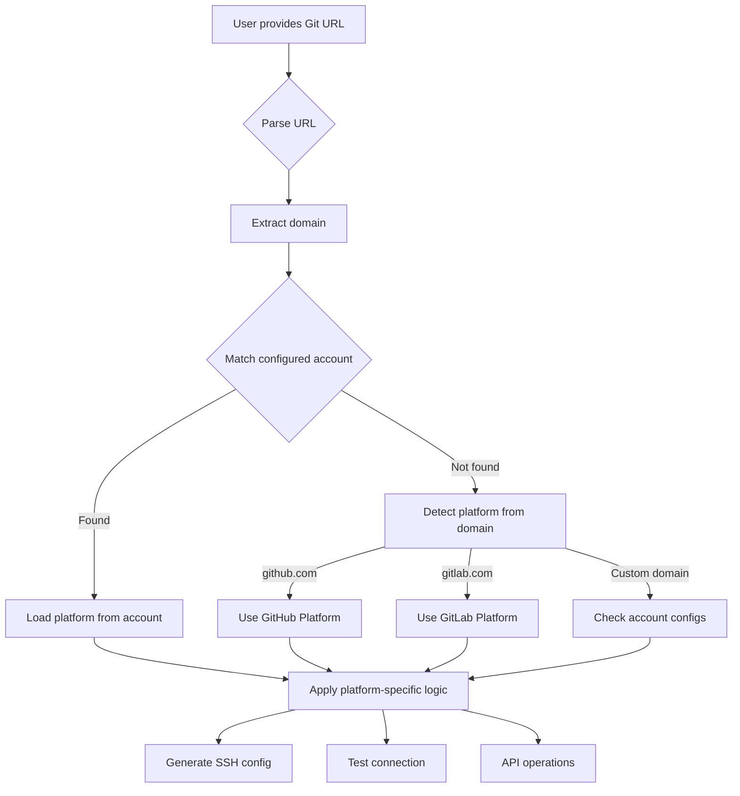

# 🏗️ gitshift Architecture Guide

> **Technical architecture and design principles of gitshift**

---

## 📖 **Table of Contents**

1. [System Overview](#system-overview)
2. [Core Architecture](#core-architecture)
3. [Service Layer](#service-layer)
4. [Data Models](#data-models)
5. [Configuration Management](#configuration-management)
6. [Security Architecture](#security-architecture)
7. [Performance Considerations](#performance-considerations)
8. [Extension Points](#extension-points)
9. [Development Guidelines](#development-guidelines)

---

## 🎯 **System Overview**

### **High-Level Architecture**

```
┌─────────────────────────────────────────────────────────────┐
│                    gitshift System                        │
├─────────────────────────────────────────────────────────────┤
│  CLI Layer (Cobra Commands)                                │
│  ├─ switch, add-github, diagnose, ssh-keys, etc.          │
├─────────────────────────────────────────────────────────────┤
│  Service Layer (Business Logic)                            │
│  ├─ AccountService, SSHService, GitHubService, etc.       │
├─────────────────────────────────────────────────────────────┤
│  Infrastructure Layer (External Integrations)              │
│  ├─ Git, SSH, GitHub CLI, File System, etc.               │
└─────────────────────────────────────────────────────────────┘
```

### **Design Principles**

- **🔧 Modular Design**: Clean separation of concerns with dependency injection
- **🛡️ Security-First**: Cryptographic best practices and secure defaults
- **🔍 Proactive Monitoring**: Intelligent issue detection and auto-repair
- **⚡ Performance**: Optimized for speed and efficiency
- **🧪 Testable**: Comprehensive validation framework and mocking support
- **📈 Scalable**: Designed to handle multiple accounts and configurations

---

## 🏛️ **Core Architecture**

### **Layered Architecture**

```
┌─────────────────────────────────────────────────────────────┐
│                    Presentation Layer                       │
│  ┌─────────────────┐  ┌─────────────────┐  ┌──────────────┐ │
│  │   CLI Commands  │  │   TUI Interface │  │   Web API    │ │
│  │   (Cobra)       │  │   (Bubble Tea)  │  │   (Future)   │ │
│  └─────────────────┘  └─────────────────┘  └──────────────┘ │
├─────────────────────────────────────────────────────────────┤
│                    Application Layer                        │
│  ┌─────────────────┐  ┌─────────────────┐  ┌──────────────┐ │
│  │  Command        │  │  Validation     │  │  Error       │ │
│  │  Handlers       │  │  Layer          │  │  Handling    │ │
│  └─────────────────┘  └─────────────────┘  └──────────────┘ │
├─────────────────────────────────────────────────────────────┤
│                    Service Layer                            │
│  ┌─────────────────┐  ┌─────────────────┐  ┌──────────────┐ │
│  │  Account        │  │  SSH            │  │  GitHub      │ │
│  │  Service        │  │  Service        │  │  Service     │ │
│  └─────────────────┘  └─────────────────┘  └──────────────┘ │
├─────────────────────────────────────────────────────────────┤
│                    Infrastructure Layer                     │
│  ┌─────────────────┐  ┌─────────────────┐  ┌──────────────┐ │
│  │  File System    │  │  External       │  │  Network     │ │
│  │  Operations     │  │  Commands       │  │  Operations  │ │
│  └─────────────────┘  └─────────────────┘  └──────────────┘ │
└─────────────────────────────────────────────────────────────┘
```

### **Dependency Injection Container**

```go
// Service Container Pattern
type SimpleContainer struct {
    configService     services.ConfigurationService
    accountService    services.AccountService
    sshService        services.SSHService
    sshAgentService   services.SSHAgentService
    gitService        services.GitConfigManager
    githubService     services.GitHubService
    zshSecretsService services.ZshSecretsService
    logger            observability.Logger
}
```

---

## 🔧 **Service Layer**

### **Core Services**

#### **ConfigurationService**
```go
type ConfigurationService interface {
    Load(ctx context.Context) error
    Save(ctx context.Context) error
    GetAccount(ctx context.Context, alias string) (*models.Account, error)
    SetAccount(ctx context.Context, account *models.Account) error
    SetCurrentAccount(ctx context.Context, alias string) error
    GetCurrentAccount(ctx context.Context) string
}
```

**Responsibilities**:
- Configuration file management (YAML)
- Account CRUD operations
- Current account state management
- Configuration validation and migration

#### **AccountService**
```go
type AccountService interface {
    GetAccount(ctx context.Context, alias string) (*models.Account, error)
    CreateAccount(ctx context.Context, account *models.Account) error
    UpdateAccount(ctx context.Context, account *models.Account) error
    DeleteAccount(ctx context.Context, alias string) error
    ListAccounts(ctx context.Context) ([]*models.Account, error)
    SetCurrentAccount(ctx context.Context, alias string) error
    ValidateAccount(ctx context.Context, account *models.Account) error
}
```

**Responsibilities**:
- Account lifecycle management
- Account validation and integrity checks
- Account switching logic
- Account discovery and auto-completion

#### **SSHService**
```go
type SSHService interface {
    GenerateKey(ctx context.Context, keyType string, email string, keyPath string) (*SSHKey, error)
    ValidateKey(ctx context.Context, keyPath string) (*SSHKeyInfo, error)
    ListKeys(ctx context.Context) ([]*SSHKeyInfo, error)
    TestGitHubAuthentication(ctx context.Context, keyPath string) error
    GenerateSSHConfig(ctx context.Context) (string, error)
}
```

**Responsibilities**:
- SSH key generation and management
- SSH key validation and testing
- SSH configuration generation
- GitHub authentication testing

#### **SSHAgentService**
```go
type SSHAgentService interface {
    IsAgentRunning(ctx context.Context) (bool, error)
    StartAgent(ctx context.Context) error
    LoadKey(ctx context.Context, keyPath string) error
    ClearAllKeys(ctx context.Context) error
    SwitchToAccount(ctx context.Context, keyPath string) error
    SwitchToAccountWithCleanup(ctx context.Context, keyPath string) error
}
```

**Responsibilities**:
- SSH agent lifecycle management
- Key loading and unloading
- Account-specific key isolation
- Socket management and cleanup

#### **ZshSecretsService**
```go
type ZshSecretsService interface {
    UpdateGitHubToken(ctx context.Context, token string) error
    GetCurrentGitHubToken(ctx context.Context) (string, error)
    ReloadZshSecrets(ctx context.Context) error
    ValidateZshSecretsFile(ctx context.Context) error
}
```

**Responsibilities**:
- Zsh secrets file management
- GitHub token updates
- Environment variable management
- File validation and backup

---

### **Platform Abstraction Layer** 🆕

gitshift v0.2.0 introduces a clean platform abstraction layer to support multiple Git hosting platforms.

#### **Platform Interface**

```go
// Platform defines the interface for Git hosting platforms
type Platform interface {
    // Platform identification
    Name() string                          // e.g., "github", "gitlab"
    DefaultDomain() string                 // e.g., "github.com", "gitlab.com"

    // SSH operations
    GetSSHHost(domain string) string       // SSH hostname for platform
    TestSSHConnection(ctx context.Context, username string, domain string, keyPath string) error

    // API operations
    GetAPIEndpoint(domain string) string   // API endpoint URL
    ValidateCredentials(ctx context.Context, token string, domain string) error

    // Repository operations
    ParseRepoURL(url string) (*RepoInfo, error)
    IsValidRepoURL(url string) bool
}
```

#### **Platform Implementations**

**GitHub Platform** (`pkg/platform/github.go`):
```go
type GitHubPlatform struct {
    httpClient *http.Client
}

func (p *GitHubPlatform) Name() string {
    return "github"
}

func (p *GitHubPlatform) DefaultDomain() string {
    return "github.com"
}

func (p *GitHubPlatform) GetAPIEndpoint(domain string) string {
    if domain == "github.com" {
        return "https://api.github.com"
    }
    return fmt.Sprintf("https://%s/api/v3", domain)  // GitHub Enterprise
}
```

**GitLab Platform** (`pkg/platform/gitlab.go`):
```go
type GitLabPlatform struct {
    httpClient *http.Client
}

func (p *GitLabPlatform) Name() string {
    return "gitlab"
}

func (p *GitLabPlatform) DefaultDomain() string {
    return "gitlab.com"
}

func (p *GitLabPlatform) GetAPIEndpoint(domain string) string {
    return fmt.Sprintf("https://%s/api/v4", domain)  // GitLab API v4
}
```

#### **Platform Factory**

```go
// Factory pattern for creating platform instances
type PlatformFactory interface {
    GetPlatform(platformType string) (Platform, error)
    RegisterPlatform(platformType string, platform Platform) error
}

type DefaultPlatformFactory struct {
    platforms map[string]Platform
}

func NewPlatformFactory() *DefaultPlatformFactory {
    factory := &DefaultPlatformFactory{
        platforms: make(map[string]Platform),
    }

    // Register built-in platforms
    factory.RegisterPlatform("github", NewGitHubPlatform())
    factory.RegisterPlatform("gitlab", NewGitLabPlatform())

    return factory
}

func (f *DefaultPlatformFactory) GetPlatform(platformType string) (Platform, error) {
    platform, exists := f.platforms[platformType]
    if !exists {
        return nil, fmt.Errorf("unsupported platform: %s", platformType)
    }
    return platform, nil
}
```

#### **Platform Service Integration**

The platform layer integrates with existing services:

```go
type SSHService interface {
    // Enhanced with platform support
    TestPlatformAuthentication(ctx context.Context,
        platform Platform,
        username string,
        domain string,
        keyPath string) error

    GenerateSSHConfigForPlatform(ctx context.Context,
        account *models.Account,
        platform Platform) (string, error)
}

type AccountService interface {
    // Platform-aware operations
    SwitchAccountWithPlatform(ctx context.Context,
        alias string,
        platform Platform) error

    DiscoverAccountsForPlatform(ctx context.Context,
        platform Platform) ([]*models.Account, error)
}
```

#### **Platform Detection Flow**



#### **Extended Account Model**

The Account model now includes platform-specific fields:

```go
type Account struct {
    // Existing fields
    Alias          string        `json:"alias" yaml:"alias"`
    Name           string        `json:"name" yaml:"name"`
    Email          string        `json:"email" yaml:"email"`
    SSHKeyPath     string        `json:"ssh_key_path" yaml:"ssh_key_path"`

    // Platform-specific fields (NEW)
    Platform       string        `json:"platform,omitempty" yaml:"platform,omitempty"`           // github, gitlab, etc.
    Domain         string        `json:"domain,omitempty" yaml:"domain,omitempty"`               // Custom domain
    Username       string        `json:"username,omitempty" yaml:"username,omitempty"`           // Platform username
    APIEndpoint    string        `json:"api_endpoint,omitempty" yaml:"api_endpoint,omitempty"`   // Custom API URL

    // Deprecated (backward compatibility)
    GitHubUsername string        `json:"github_username,omitempty" yaml:"github_username,omitempty"` // DEPRECATED

    // Other fields
    Description    string        `json:"description,omitempty" yaml:"description,omitempty"`
    IsDefault      bool          `json:"is_default" yaml:"is_default"`
    Status         AccountStatus `json:"status" yaml:"status"`
    CreatedAt      time.Time     `json:"created_at" yaml:"created_at"`
    LastUsed       *time.Time    `json:"last_used,omitempty" yaml:"last_used,omitempty"`
}

// Helper method for backward compatibility
func (a *Account) GetUsername() string {
    if a.Username != "" {
        return a.Username
    }
    return a.GitHubUsername  // Fallback to deprecated field
}

// Helper method for platform detection
func (a *Account) GetPlatform() string {
    if a.Platform != "" {
        return a.Platform
    }
    return "github"  // Default to GitHub for backward compatibility
}
```

#### **Benefits of Platform Abstraction**

✅ **Extensibility**: Easy to add new platforms (Bitbucket, Gitea, etc.)
✅ **Maintainability**: Platform-specific logic isolated in dedicated modules
✅ **Testability**: Mock platforms for testing without external dependencies
✅ **Backward Compatibility**: Existing GitHub-only configs work without changes
✅ **Type Safety**: Compile-time verification of platform operations
✅ **Clean Code**: No platform-specific if/else chains in business logic

#### **Adding New Platforms**

To add support for a new platform:

1. **Implement Platform Interface**:
   ```go
   type BitbucketPlatform struct {
       httpClient *http.Client
   }

   func (p *BitbucketPlatform) Name() string {
       return "bitbucket"
   }
   // Implement other interface methods...
   ```

2. **Register with Factory**:
   ```go
   factory.RegisterPlatform("bitbucket", NewBitbucketPlatform())
   ```

3. **Update Documentation**:
   - Add to supported platforms table
   - Document platform-specific configuration
   - Add usage examples

See [Contributing Guide](CONTRIBUTING.md) for detailed platform extension guidelines.

---

### **Service Communication**

```go
// Service dependencies are injected via container
type SwitchCommand struct {
    container *container.SimpleContainer
}

func (c *SwitchCommand) performAccountSwitch(ctx context.Context, targetAccount *models.Account) error {
    // Get services from container
    configService := c.container.GetConfigService()
    sshAgentService := c.container.GetSSHAgentService()
    zshSecretsService := c.container.GetZshSecretsService()

    // Orchestrate service calls
    // ...
}
```

---

## 📊 **Data Models**

### **Core Models**

#### **Account Model**
```go
type Account struct {
    Alias          string        `json:"alias" yaml:"alias"`
    Name           string        `json:"name" yaml:"name"`
    Email          string        `json:"email" yaml:"email"`
    SSHKeyPath     string        `json:"ssh_key_path" yaml:"ssh_key_path"`
    GitHubUsername string        `json:"github_username" yaml:"github_username"`
    Description    string        `json:"description,omitempty" yaml:"description,omitempty"`
    IsDefault      bool          `json:"is_default" yaml:"is_default"`
    Status         AccountStatus `json:"status" yaml:"status"`
    CreatedAt      time.Time     `json:"created_at" yaml:"created_at"`
    LastUsed       *time.Time    `json:"last_used,omitempty" yaml:"last_used,omitempty"`
}
```

#### **Configuration Model**
```go
type Config struct {
    Accounts        map[string]*Account        `json:"accounts" yaml:"accounts"`
    PendingAccounts map[string]*PendingAccount `json:"pending_accounts,omitempty" yaml:"pending_accounts,omitempty"`
    CurrentAccount  string                     `json:"current_account,omitempty" yaml:"current_account,omitempty"`
    GlobalGitConfig bool                       `json:"global_git_config" yaml:"global_git_config"`
    AutoDetect      bool                       `json:"auto_detect" yaml:"auto_detect"`
    ConfigVersion   string                     `json:"config_version" yaml:"config_version"`
}
```

### **Data Flow**

```
┌─────────────────┐    ┌─────────────────┐    ┌─────────────────┐
│   User Input    │ -> │   Validation    │ -> │   Data Models   │
│   (Commands)    │    │   Layer         │    │   (Accounts)    │
└─────────────────┘    └─────────────────┘    └─────────────────┘
         │                       │                       │
         v                       v                       v
┌─────────────────┐    ┌─────────────────┐    ┌─────────────────┐
│   Service       │ -> │   Business      │ -> │   Persistence   │
│   Layer         │    │   Logic         │    │   (YAML Files)  │
└─────────────────┘    └─────────────────┘    └─────────────────┘
```

---

## ⚙️ **Configuration Management**

### **Configuration Architecture**

```
┌─────────────────────────────────────────────────────────────┐
│                Configuration Management                     │
├─────────────────────────────────────────────────────────────┤
│  ┌─────────────────┐  ┌─────────────────┐  ┌──────────────┐ │
│  │   YAML Parser   │  │   Validation    │  │   Migration  │ │
│  │   (Viper)       │  │   Layer         │  │   System     │ │
│  └─────────────────┘  └─────────────────┘  └──────────────┘ │
├─────────────────────────────────────────────────────────────┤
│  ┌─────────────────┐  ┌─────────────────┐  ┌──────────────┐ │
│  │   File System   │  │   Environment   │  │   Defaults   │ │
│  │   Operations    │  │   Variables     │  │   Manager    │ │
│  └─────────────────┘  └─────────────────┘  └──────────────┘ │
└─────────────────────────────────────────────────────────────┘
```

### **Configuration Loading Process**

```go
func (m *Manager) Load() error {
    // 1. Ensure config directory exists
    if err := os.MkdirAll(m.configPath, 0755); err != nil {
        return fmt.Errorf("failed to create config directory: %w", err)
    }

    // 2. Check if config file exists
    configFile := filepath.Join(m.configPath, ConfigFileName+".yaml")
    if _, err := os.Stat(configFile); os.IsNotExist(err) {
        return m.Save() // Create default config
    }

    // 3. Parse YAML configuration
    v := viper.New()
    v.SetConfigFile(configFile)
    v.SetConfigType("yaml")

    if err := v.ReadInConfig(); err != nil {
        return fmt.Errorf("failed to read config file: %w", err)
    }

    // 4. Unmarshal into struct
    if err := v.Unmarshal(m.config); err != nil {
        return fmt.Errorf("failed to unmarshal config: %w", err)
    }

    // 5. Initialize maps if nil
    if m.config.Accounts == nil {
        m.config.Accounts = make(map[string]*models.Account)
    }

    return nil
}
```

### **Configuration Validation**

```go
func (a *Account) Validate() error {
    if a.Alias == "" {
        return ErrInvalidAlias
    }

    hasBasicInfo := a.Name != "" && a.Email != ""
    hasGitHubInfo := a.GitHubUsername != ""

    if !hasBasicInfo && !hasGitHubInfo {
        return ErrInvalidConfig
    }

    if a.Email != "" && !isValidEmail(a.Email) {
        return ErrInvalidEmailFormat
    }

    if a.GitHubUsername != "" && !isValidGitHubUsername(a.GitHubUsername) {
        return ErrInvalidGitHubUsernameFormat
    }

    return nil
}
```

---

## 🔒 **Security Architecture**

### **Security Layers**

```
┌─────────────────────────────────────────────────────────────┐
│                    Security Architecture                    │
├─────────────────────────────────────────────────────────────┤
│  ┌─────────────────┐  ┌─────────────────┐  ┌──────────────┐ │
│  │   Input         │  │   Data          │  │   Output     │ │
│  │   Validation    │  │   Encryption    │  │   Sanitization│ │
│  └─────────────────┘  └─────────────────┘  └──────────────┘ │
├─────────────────────────────────────────────────────────────┤
│  ┌─────────────────┐  ┌─────────────────┐  ┌──────────────┐ │
│  │   File          │  │   Network       │  │   Process    │ │
│  │   Permissions   │  │   Security      │  │   Isolation  │ │
│  └─────────────────┘  └─────────────────┘  └──────────────┘ │
└─────────────────────────────────────────────────────────────┘
```

### **Security Measures**

#### **File Security**
```go
// Secure file permissions
func (s *RealZshSecretsService) writeSecretsFile(path string, content string) error {
    // Ensure directory exists with secure permissions
    dir := filepath.Dir(path)
    if err := os.MkdirAll(dir, 0755); err != nil {
        return fmt.Errorf("failed to create directory: %w", err)
    }

    // Write file with secure permissions (600)
    if err := os.WriteFile(path, []byte(content), 0600); err != nil {
        return fmt.Errorf("failed to write file: %w", err)
    }

    return nil
}
```

#### **Input Validation**
```go
// Email validation
func isValidEmail(email string) bool {
    if email == "" {
        return false
    }
    emailRegex := regexp.MustCompile(`^[a-zA-Z0-9._%+-]+@[a-zA-Z0-9.-]+\.[a-zA-Z]{2,}$`)
    return emailRegex.MatchString(email)
}

// GitHub username validation
func isValidGitHubUsername(username string) bool {
    if username == "" || len(username) > 39 || len(username) < 1 {
        return false
    }
    if strings.HasPrefix(username, "-") || strings.HasSuffix(username, "-") {
        return false
    }
    if strings.Contains(username, "--") {
        return false
    }
    usernameRegex := regexp.MustCompile(`^[a-zA-Z0-9-]+$`)
    return usernameRegex.MatchString(username)
}
```

#### **SSH Key Security**
```go
// Secure SSH key generation
func (cm *ModernCryptoManager) GenerateEd25519Key(alias, email string) (string, error) {
    // Generate Ed25519 key pair
    publicKey, privateKey, err := ed25519.GenerateKey(rand.Reader)
    if err != nil {
        return "", fmt.Errorf("failed to generate Ed25519 key: %w", err)
    }

    // Save private key with strict permissions
    if err := os.WriteFile(privateKeyPath, pem.EncodeToMemory(opensshPrivateKey), 0600); err != nil {
        return "", fmt.Errorf("failed to write private key: %w", err)
    }

    // Set extended attributes for security metadata
    cm.setSecurityMetadata(privateKeyPath, alias)

    return privateKeyPath, nil
}
```

---

## ⚡ **Performance Considerations**

### **Performance Architecture**

```
┌─────────────────────────────────────────────────────────────┐
│                Performance Optimization                     │
├─────────────────────────────────────────────────────────────┤
│  ┌─────────────────┐  ┌─────────────────┐  ┌──────────────┐ │
│  │   Caching       │  │   Parallel      │  │   Lazy       │ │
│  │   Layer         │  │   Processing    │  │   Loading    │ │
│  └─────────────────┘  └─────────────────┘  └──────────────┘ │
├─────────────────────────────────────────────────────────────┤
│  ┌─────────────────┐  ┌─────────────────┐  ┌──────────────┐ │
│  │   Connection    │  │   Resource      │  │   Memory     │ │
│  │   Pooling       │  │   Management    │  │   Optimization│ │
│  └─────────────────┘  └─────────────────┘  └──────────────┘ │
└─────────────────────────────────────────────────────────────┘
```

### **Performance Optimizations**

#### **Caching Strategy**
```go
type CachedConfigService struct {
    cache     map[string]*models.Account
    cacheTTL  time.Duration
    lastLoad  time.Time
    mutex     sync.RWMutex
}

func (c *CachedConfigService) GetAccount(ctx context.Context, alias string) (*models.Account, error) {
    c.mutex.RLock()
    defer c.mutex.RUnlock()

    // Check cache first
    if account, exists := c.cache[alias]; exists {
        return account, nil
    }

    // Load from disk if not in cache
    return c.loadAccountFromDisk(ctx, alias)
}
```

#### **Parallel Processing**
```go
func (c *SwitchCommand) validateAccountSSH(ctx context.Context, account *models.Account) error {
    // Run SSH validation in parallel with other operations
    sshChan := make(chan error, 1)
    go func() {
        sshChan <- c.validateSSHConnection(ctx, account.SSHKeyPath)
    }()

    // Do other validations in parallel
    gitChan := make(chan error, 1)
    go func() {
        gitChan <- c.validateGitConfig(ctx, account)
    }()

    // Wait for all validations to complete
    sshErr := <-sshChan
    gitErr := <-gitChan

    if sshErr != nil {
        return sshErr
    }
    return gitErr
}
```

#### **Lazy Loading**
```go
type LazySSHService struct {
    sshKeys    []*SSHKeyInfo
    loaded     bool
    mutex      sync.Mutex
}

func (s *LazySSHService) ListKeys(ctx context.Context) ([]*SSHKeyInfo, error) {
    s.mutex.Lock()
    defer s.mutex.Unlock()

    if !s.loaded {
        if err := s.loadKeys(ctx); err != nil {
            return nil, err
        }
        s.loaded = true
    }

    return s.sshKeys, nil
}
```

### **Performance Benchmarks**

| Operation | Target Time | Memory Usage | Optimization |
|-----------|-------------|--------------|--------------|
| Account Switch | <50ms | <10MB | Caching, parallel validation |
| SSH Validation | <100ms | <5MB | Connection pooling |
| Full Diagnosis | <200ms | <15MB | Lazy loading, parallel checks |
| GitHub API Call | <300ms | <8MB | Request batching |

---

## 🔌 **Extension Points**

### **Plugin Architecture**

```go
// Plugin interface for extending functionality
type Plugin interface {
    Name() string
    Version() string
    Initialize(ctx context.Context, container *container.SimpleContainer) error
    Execute(ctx context.Context, args []string) error
    Cleanup(ctx context.Context) error
}

// Plugin registry
type PluginRegistry struct {
    plugins map[string]Plugin
    mutex   sync.RWMutex
}

func (r *PluginRegistry) Register(plugin Plugin) error {
    r.mutex.Lock()
    defer r.mutex.Unlock()

    if _, exists := r.plugins[plugin.Name()]; exists {
        return fmt.Errorf("plugin %s already registered", plugin.Name())
    }

    r.plugins[plugin.Name()] = plugin
    return nil
}
```

### **Custom Services**

```go
// Custom service implementation
type CustomSSHService struct {
    logger observability.Logger
    runner execrunner.CmdRunner
}

func (s *CustomSSHService) GenerateKey(ctx context.Context, keyType string, email string, keyPath string) (*SSHKey, error) {
    // Custom SSH key generation logic
    // ...
}

// Register custom service
container.SetSSHService(&CustomSSHService{
    logger: logger,
    runner: runner,
})
```

### **Custom Commands**

```go
// Custom command implementation
type CustomCommand struct {
    *commands.BaseCommand
}

func (c *CustomCommand) Run(ctx context.Context, args []string) error {
    // Custom command logic
    // ...
}

// Register custom command
rootCmd.AddCommand(customCommand.CreateCobraCommand())
```

---

## 🛠️ **Development Guidelines**

### **Code Organization**

```
internal/
├── commands/          # Command definitions and handlers
├── config/           # Configuration management
├── container/        # Dependency injection container
├── discovery/        # Account discovery logic
├── errors/           # Error handling and types
├── execrunner/       # External command execution
├── git/              # Git operations
├── github/           # GitHub API integration
├── models/           # Data models and types
├── observability/    # Logging and metrics
├── security/         # Cryptographic operations
├── services/         # Business logic services
├── tui/              # Terminal user interface
├── update/           # Update management
└── validation/       # Validation logic
```

### **Service Implementation Pattern**

```go
// 1. Define interface
type MyService interface {
    DoSomething(ctx context.Context, input string) (string, error)
}

// 2. Implement service
type RealMyService struct {
    logger observability.Logger
    runner execrunner.CmdRunner
}

func NewMyService(logger observability.Logger, runner execrunner.CmdRunner) *RealMyService {
    return &RealMyService{
        logger: logger,
        runner: runner,
    }
}

func (s *RealMyService) DoSomething(ctx context.Context, input string) (string, error) {
    s.logger.Info(ctx, "doing_something", observability.F("input", input))

    // Implementation logic
    result := "processed: " + input

    s.logger.Info(ctx, "something_done", observability.F("result", result))
    return result, nil
}

// 3. Register in container
container.SetMyService(services.NewMyService(logger, runner))
```

### **Error Handling Pattern**

```go
// 1. Define error types
var (
    ErrMyServiceFailed = errors.New("my_service_failed")
    ErrInvalidInput    = errors.New("invalid_input")
)

// 2. Wrap errors with context
func (s *MyService) DoSomething(ctx context.Context, input string) (string, error) {
    if input == "" {
        return "", errors.Wrap(ErrInvalidInput, "input cannot be empty").
            WithContext("field", "input").
            WithContext("value", input)
    }

    result, err := s.processInput(input)
    if err != nil {
        return "", errors.Wrap(err, ErrMyServiceFailed).
            WithContext("operation", "process_input").
            WithContext("input", input)
    }

    return result, nil
}
```

### **Testing Patterns**

```go
// 1. Mock interfaces for testing
type MockMyService struct {
    DoSomethingFunc func(ctx context.Context, input string) (string, error)
}

func (m *MockMyService) DoSomething(ctx context.Context, input string) (string, error) {
    if m.DoSomethingFunc != nil {
        return m.DoSomethingFunc(ctx, input)
    }
    return "", nil
}

// 2. Test with mocks
func TestMyService(t *testing.T) {
    mockService := &MockMyService{
        DoSomethingFunc: func(ctx context.Context, input string) (string, error) {
            return "mocked: " + input, nil
        },
    }

    result, err := mockService.DoSomething(context.Background(), "test")
    assert.NoError(t, err)
    assert.Equal(t, "mocked: test", result)
}
```

---

## 📚 **Additional Resources**

- **[User Guide](USER_GUIDE.md)** - Complete user documentation
- **[Configuration Guide](CONFIGURATION.md)** - Detailed configuration options
- **[Troubleshooting Guide](TROUBLESHOOTING.md)** - Common issues and solutions
- **[Security Guide](SECURITY.md)** - Security best practices
- **[Contributing Guide](CONTRIBUTING.md)** - How to contribute

---

<div align="center">

**Want to contribute to the architecture?** Check our [Contributing Guide](CONTRIBUTING.md)!

</div>
